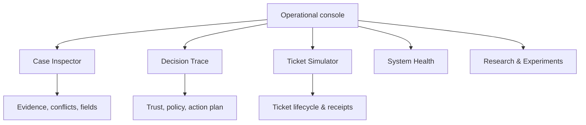

# KAWAL — Product Design System & UX Guidelines

KAWAL adalah **Kerangka Agen untuk Wadah Aduan Layanan**: sistem *trust- and policy-aware intelligent orchestration* untuk mengubah rangkaian aduan WhatsApp menjadi tiket terstruktur. Desain ini mendukung *research sandbox* hingga pilot yang diotorisasi.

Arahan visual: **Stripe-inspired, bukan menyalin Stripe**—tenang, presisi, modern, berlapis rapi, dan kuat untuk produk teknis. Jangan memakai logo, aset, ilustrasi, atau komposisi layar khas Stripe secara langsung.

## 1. Batas Produk dan Prinsip UX

KAWAL bukan marketplace, portal pemerintah generik, atau aplikasi yang meminta manusia menyetujui keputusan AI. Sistem bekerja otomatis; petugas hanya menerima dan menangani tiket **setelah** sistem membuatnya.

1. **Keputusan dapat ditelusuri.** Tampilkan evidence, sumber, versi model/policy, konflik, dan alasan action tanpa membongkar chain-of-thought.
2. **Policy sebelum side effect.** Aksi kirim klarifikasi, remote-model egress, dan ticketing hanya tampak berhasil setelah gate deterministik memberi `ALLOW` dan gateway mengonfirmasi receipt.
3. **Jujur pada ketidakpastian.** Confidence, contextual trust, evidence quality, dan status pemrosesan harus berbeda secara visual dan tekstual.
4. **Privasi dahulu.** Jangan tampilkan nomor telepon, PII, signed URL, attachment sensitif, token, atau raw payload pada list, URL, toast, grafik, maupun telemetry. Gambar sensitif atau ambigu tetap privat; egress remote hanya terjadi setelah gate deterministik non-visi memberi `ALLOW`.
5. **Progressive disclosure.** Daftar kasus menjawab “apa yang perlu dipantau”; detail kasus menjawab “mengapa sistem bertindak demikian”.
6. **Calm under pressure.** Kasus urgent dan error terlihat jelas tanpa antarmuka berubah menjadi alarm merah yang kacau.

### Keputusan runtime yang harus tercermin di UI

| Konsep | Aturan tampilan |
|---|---|
| Mode keputusan | Hanya `EXECUTE`, `RE-EVALUATE`, `REQUEST CLARIFICATION`, `REJECT / IGNORE` |
| Bukan mode kelima | `WAITING_DEPENDENCY`, `BLOCKED`, dan `UNRESOLVED` adalah processing state, bukan keputusan semantik baru |
| Human role | Tidak ada approval/review queue; petugas melihat dan menangani ticket yang telah dibuat |
| Risk vs sensitivity | Dua badge berbeda: priority/urgency dan restricted visibility/sensitivity |
| Claim vs fact | Label “laporan pelapor”, “observasi evidence”, atau “hasil resolver”; jangan tampilkan sebagai fakta dunia yang sudah terbukti |
| Ticket status | Tampilkan terpisah dari processing state KAWAL |

## 2. Roles and Access Boundaries

| Peran | Tujuan UI | Batas akses |
|---|---|---|
| Pelapor | Mengirim WhatsApp, menjawab klarifikasi, menerima tracking setelah receipt | Tidak melihat kasus/pelapor lain atau internal reasoning |
| Petugas ticket | Menangani ticket yang sudah dibuat | Tidak meng-approve/meng-override keputusan KAWAL sebelum create |
| Researcher/operator | Memeriksa replay, trace, eksperimen, queue health, dan simulator | Raw evidence hanya bila role/policy mengizinkan |
| Policy/authority maintainer | Melihat bundle/directory versi dan hasil evaluasi | Perubahan adalah konfigurasi terversi, bukan approval per kasus |

P0 fokus pada Case Inspector, Decision Trace, Ticket Simulator, dan System Health. Dashboard petugas/pelacakan publik adalah P1/P2 dan tidak boleh mengubah mekanisme keputusan otomatis.

## 3. Visual Foundation

### 3.1 Color tokens

Gunakan ruang netral pada mayoritas layar. Satu primary action per halaman. Status selalu memakai teks dan icon selain warna.

| Token | Value | Role |
|---|---:|---|
| `--color-ink` | `#0A2540` | Judul, teks utama, icon prioritas tinggi |
| `--color-ink-subtle` | `#425466` | Metadata dan teks sekunder |
| `--color-surface` | `#FFFFFF` | Card dan canvas utama |
| `--color-surface-muted` | `#F6F9FC` | Background, skeleton, region sekunder |
| `--color-border` | `#E3E8EE` | Divider dan outline control |
| `--color-primary` | `#635BFF` | CTA utama, selection, link |
| `--color-primary-hover` | `#514BDB` | Hover/pressed state |
| `--color-info` | `#087EA4` | Informasi teknis dan processing state |
| `--color-success` | `#0E9F6E` | Confirmed receipt, valid policy result |
| `--color-warning` | `#B45309` | Missing fields, clarification, attention |
| `--color-danger` | `#D92D20` | Error, policy denial, urgent indicator |
| `--color-restricted` | `#7C3AED` | Sensitive/restricted visibility, selalu dengan label |
| `--color-focus` | `#635BFF` | Focus ring keyboard |

Hindari full-page gradient, glassmorphism berat, neon, atau gradien sebagai pengganti hierarchy. Gradien lembut boleh sekali pada onboarding/research overview, tidak untuk background dashboard utama atau state urgent.

### 3.2 Typography

Gunakan `Inter, ui-sans-serif, system-ui, -apple-system, BlinkMacSystemFont, "Segoe UI", sans-serif`. IDs, event timestamp, model version, latency, dan cost menggunakan tabular numerals atau `ui-monospace` secukupnya.

| Role | Size / line height | Weight |
|---|---|---|
| Display / hero terbatas | 48px / 56px | 700 |
| Page title | 32px / 40px | 700 |
| Section title | 24px / 32px | 650–700 |
| Card title | 20px / 28px | 650 |
| Body | 16px / 24px | 400–500 |
| Dense table body | 14px / 20px | 400–500 |
| Label / metadata | 12px / 16px | 600 |

Jangan gunakan teks di bawah 12px atau all-caps untuk paragraf panjang.

### 3.3 Spacing, shape, and depth

Gunakan rhythm `4, 8, 12, 16, 24, 32, 48, 64px`.

| Element | Standard |
|---|---|
| Input/button/control radius | 8px |
| Card radius | 12px |
| Modal/large drawer radius | 16px |
| Mobile/desktop page gutter | 16px / 24px |
| Content max width | 1200px |
| Minimum touch target | 44px |
| Elevation | 1px border; optional `0 1px 2px rgba(10,37,64,.06), 0 4px 12px rgba(10,37,64,.05)` |

## 4. Information Architecture

| Area | P0 content | P1/P2 extension |
|---|---|---|
| Case Inspector | Case list, bubble timeline, attachments, extracted fields, conflicts, processing state | Filter presets dan scoped staff workspace |
| Decision Trace | Candidate actions, reason codes, trust inputs, policy trace, budget/cost/latency | Comparative experiment inspection |
| Ticket Simulator | Create/update/transfer/close receipt, idempotency key, fault profile, lifecycle | Authorized real adapter through same interface |
| System Health | Queue lag, worker pool, provider health, DLQ, retries | Alerts and operational dashboard |
| Research & Experiments | Model/dataset/policy manifests, baseline/ablation metrics | Export/report tooling |
| Public tracking | Out of P0 | Only tracking ID, safe status, time, and next step—never raw complaint/PII |

Do not include an approval queue, “Approve AI decision” CTA, human escalation list, or modules from unrelated product domains.

## 5. Core Workflows

### 5.1 WhatsApp complaint intake

1. Pelapor mengirim beberapa bubbles dan optional photo.
2. UI internal menunjukkan raw-message provenance dan assembly state; jangan menganggap setiap bubble sebagai case terpisah.
3. Setelah debounce, Case Inspector menampilkan snapshot, message count, attachment count, dan coverage status.
4. Processing state memakai label seperti `ASSEMBLING`, `ANALYZING`, `WAITING_RESULTS`, atau `WAITING_DEPENDENCY` dengan penjelasan singkat.

### 5.2 Clarification

Jika informasi wajib belum cukup, tampilkan `REQUEST CLARIFICATION` sebagai keputusan KAWAL, fields yang diminta, nomor round, waktu jatuh tempo, dan send receipt. Jika gambar decision-critical tertahan oleh policy privasi, tampilkan bahwa fakta visual diminta melalui teks tanpa meminta foto sensitif dikirim ulang. Pesan maksimal dua pertanyaan singkat per round. Jangan menampilkan tombol approval untuk mengirimnya.

Reply yang di-quote atau terkait harus tampak sebagai bubble baru yang di-link ke case/revision; jika korelasi ambigu, tampilkan reason dan `association confidence`, bukan asumsi diam-diam.

### 5.3 Automatic ticket creation

`EXECUTE` hanya ditampilkan confirmed ketika policy `ALLOW` dan ticket gateway memberi receipt. Sebelum itu gunakan `EXECUTING`, bukan “ticket created”. Tracking ID hanya tampil/sent sesudah receipt. Attachment terlambat memperbarui case atau ticket yang sama; jangan membuat ticket kedua.

### 5.4 Re-evaluation, reject, and unresolved

`RE-EVALUATE` menjelaskan bounded task yang dijadwalkan dan alasan seperti conflict material atau expected information gain. `REJECT / IGNORE` wajib menampilkan reason yang didukung evidence. Ketika budget/dependency/clarification limit habis, gunakan `UNRESOLVED` dengan typed reason; jangan menamainya rejection atau menampilkan seolah manusia akan memutuskan.

## 6. Screen Specifications

### 6.1 Case list

Tampilkan table/data list dense dengan kolom: internal case reference, safe summary, category, processing state, ticket status bila ada, risk, sensitivity, last update, dan action/detail. Gunakan filter yang tersimpan untuk `Urgent`, `Waiting clarification`, `Policy blocked`, `Unresolved`, dan `Ticketed`.

Tidak ada PII dalam row preview. `Urgent` memakai label/icon tambahan; `Sensitive` memakai label `Restricted` terpisah. Jangan menyatukan risk dengan sensitivity dalam satu warna/badge.

### 6.2 Case detail

Susunan utama:

1. Header: internal reference, processing/ticket status, risk, restricted indicator, last update.
2. Timeline bubbles: message, attachment, clarification, model result, decision, ticket event; masing-masing punya timestamp dan provenance.
3. Evidence panel: text spans, attachment relevance, entity/field source, coverage, confidence, dan status egress yang aman. Raw sensitive evidence dimasking bila role tidak berhak; tampilkan `Private only` atau `Remote VLM analyzed` beserta reason code kebijakan yang aman.
4. Fields panel: category, location, required/missing fields, authority candidate, duplicate candidate, dan conflict.
5. Decision summary: selected mode, execution strategy bila `EXECUTE`, reason codes, policy result, and receipt.

Visualisasi confidence tidak boleh menyerupai “truth meter”. Gunakan label seperti `Model confidence`, `Contextual trust`, dan `Evidence coverage`, disertai tooltip definisi singkat dan source/version.

### 6.3 Decision Trace

Tampilkan decision snapshot yang immutable: input revision/hash, used/ignored agent result, calibrated prediction, trust components, conflict type/severity, feasible/blocked actions, policy bundle/rule IDs, budget reservation, selected mode, and command receipt.

Candidate action panel menggunakan table: action, feasibility, reason, estimated cost, latency, policy result. Saat deny, tampilkan alasan aman (`Missing mandatory location`, `Restricted attachment egress denied`), bukan policy internals atau secret configuration.

### 6.4 Ticket detail and simulator

Bedakan jelas:

- **Processing lifecycle:** `ASSEMBLING → READY → ANALYZING → ... → TICKETED`.
- **Ticket lifecycle:** `SUBMITTED → VERIFIED → TRANSFERRED / IN_PROGRESS → RESOLVED → CLOSED`.

Tampilkan idempotency receipt, external ticket reference (masked/scoped bila perlu), source event, previous/new revision, and retry/reconciliation state. Simulator fault actions hanya tersedia pada research sandbox dan harus diberi label environment.

### 6.5 Health and research views

System Health menunjukkan messages/sec, cases/sec, queue depth/lag, worker utilization, provider latency, retries, DLQ, and component p50/p95/p99. Research view menunjukkan model/version, dataset/split hash, policy/authority version, baseline/ablation, quality, calibration, cost/case, and local-only resolution.

Selalu tampilkan time range, sample/denominator, source, and whether a value is estimated, actual, or unavailable. Chart harus memiliki tabel atau ringkasan tekstual ekuivalen.

## 7. Components and States

### Components

- **Buttons:** `primary`, `secondary`, `ghost`, `destructive`; semua memiliki default/hover/focus-visible/pressed/disabled/loading. Destructive controls membutuhkan confirmation jika irreversible.
- **Badges:** processing state, ticket state, risk, restricted, conflict, policy. Gunakan text + icon; bukan warna saja.
- **Evidence chip:** source type (`Text span`, `Image`, `Database`, `Rule`), provenance reference, safe preview, and availability.
- **Conflict panel:** type, severity, conflicting outputs, consequence, and selected resolution; jangan tampilkan sebagai error generik.
- **Policy result:** `ALLOW` / `DENY` + rule/reason code; `DENY` tidak boleh ambigu dengan technical outage.
- **Tables:** sticky header bila berguna, numbers right-aligned, text filter/sort state visible, horizontal scroll pada mobile—jangan silent truncate.
- **Timeline:** logical event order, event ID in detail view, stale/ignored result visually distinct from accepted result.

### Required states

Semua screen yang memanggil data menyediakan loading, empty, error, permission-denied, retryable dependency failure, and stale-data state. Toast hanya untuk konfirmasi non-kritis; error policy, failed ticket execution, atau unresolved state harus tampil persistent dan dapat ditindaklanjuti.

## 8. Interaction and Motion

- Gunakan motion 150–220ms, ease-out, hanya untuk memperjelas hubungan antarelemen.
- Hormati `prefers-reduced-motion`; nonaktifkan animasi dekoratif.
- Keyboard focus harus terlihat dengan ring minimal 2px `--color-focus` dan offset yang cukup.
- Jangan auto-refresh sampai merebut focus atau mengubah posisi item yang sedang dibaca. Tampilkan “Data terbaru tersedia” untuk refresh manual bila perlu.
- Optimistic UI hanya untuk aksi yang memiliki rollback/reconciliation jelas; ticket create berstatus pending sampai receipt ada.

## 9. Accessibility and Localization

- Target minimum WCAG 2.2 AA: contrast 4.5:1 untuk text normal dan 3:1 untuk large text/komponen UI.
- Semua workflow dapat diselesaikan dengan keyboard; focus order mengikuti visual order.
- Gunakan semantic HTML terlebih dahulu; ARIA hanya melengkapi semantic yang belum tersedia.
- Field punya visible label; errors/help text diasosiasikan secara programatik; update status penting menggunakan live region yang tidak berlebihan.
- Minimal touch target 44×44px; layar tetap berfungsi di zoom 200% dan lebar 320px.
- Alt text wajib untuk imagery/evidence yang bermakna. Dekorasi memakai empty alt. Attachment yang dibatasi access menampilkan explanatory placeholder, bukan broken image.
- Gunakan `id-ID` sebagai locale awal: bahasa yang ringkas dan formal, timezone eksplisit, serta format waktu konsisten. Hindari istilah ambigu seperti “segera” tanpa timestamp/status.

## 10. Privacy and Safety by Design

- Mask nomor telepon, email, NIK, alamat detail, ticket reference eksternal, dan attachment sensitive secara default.
- Jangan menaruh raw PII pada URL, query parameter, page title, client analytics, client error reports, clipboard, or toast.
- Akses evidence mengikuti policy/RBAC; UI menunjukkan akses dibatasi tanpa membocorkan isi yang diblokir.
- Klarifikasi yang dikirim harus menggunakan fields yang telah dipilih system dan menunjukkan command receipt, bukan raw prompt/model transcript.
- Action eksternal selalu menyertakan environment/status confirmation. Sandbox tidak boleh secara visual tampak seperti integrasi pemerintah production.
- `ALLOW` policy tidak berarti klaim pelapor benar; ini hanya berarti action memenuhi constraints sistem.

## 11. Quality Checklist

Sebelum UI merge, pastikan:

- [ ] Tidak ada terminologi, data model, atau workflow dari produk yang tidak terkait KAWAL.
- [ ] Tidak ada approval queue atau CTA untuk human approve/override KAWAL decision.
- [ ] Keempat decision modes dan operational states dibedakan dengan tepat.
- [ ] Processing lifecycle dan ticket lifecycle tidak dicampur.
- [ ] Risk, sensitivity, confidence, trust, and evidence coverage tidak digabung menjadi satu skor/badge.
- [ ] Ticket baru tampil confirmed hanya setelah gateway receipt.
- [ ] PII/sensitive evidence tidak muncul di list, URL, toast, atau telemetry UI.
- [ ] UI memakai visual direction Stripe-inspired tanpa copied assets/compositions.
- [ ] Keyboard, focus-visible, reduced motion, 320px, zoom 200%, and WCAG AA checks lulus.
- [ ] Loading, empty, denied, provider outage, stale result, and unresolved states dirancang.
