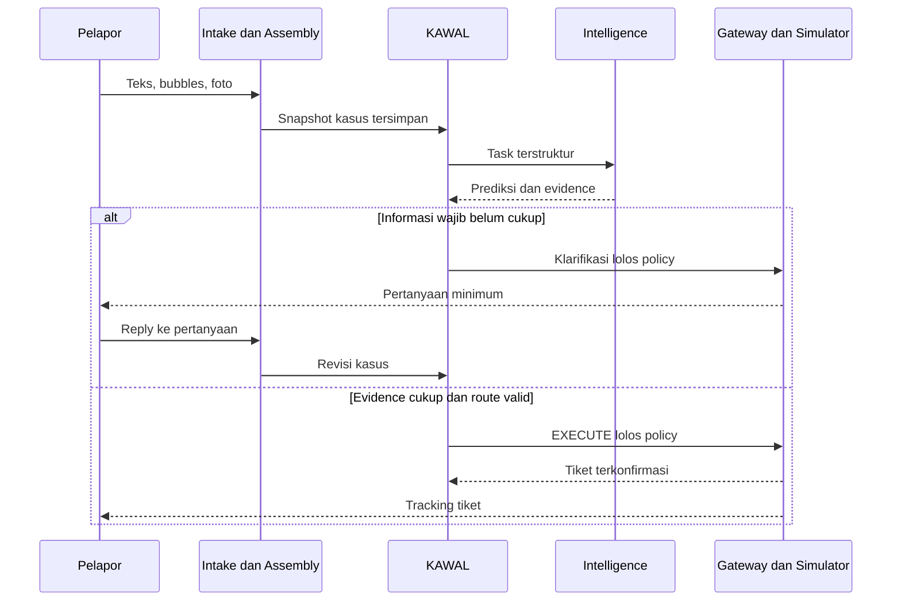
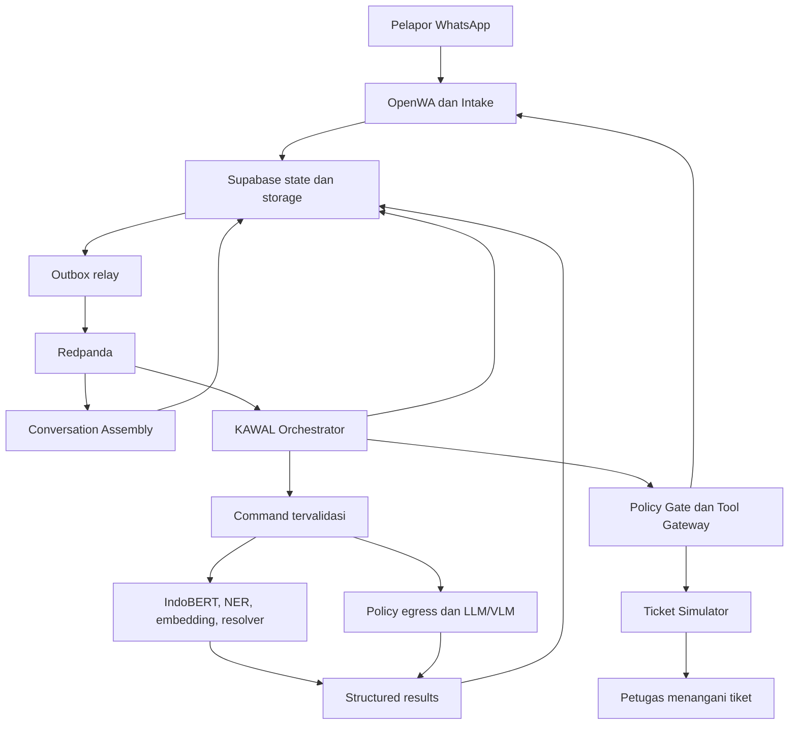
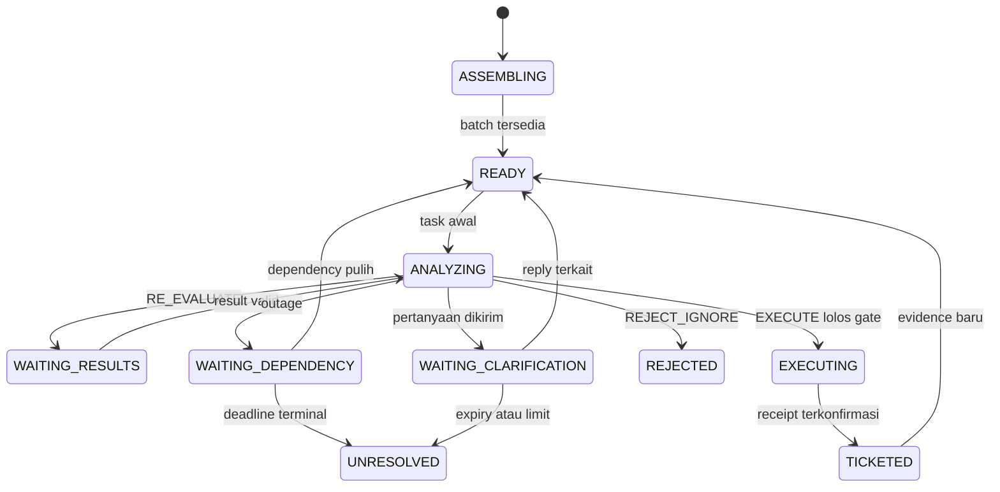

# KAWAL — Product Requirements Document

**Kerangka Agen untuk Wadah Aduan Layanan**

> Kontribusi utama: **Model-agnostic trust- and policy-aware intelligent orchestration with adaptive computational escalation for automated public complaint processing.**

**Navigasi:** [Konteks dan penelitian](#1-document-metadata) · [Arsitektur](#15-core-architectural-principles) · [Dataset dan training](#19-synthetic-dataset-generation) · [Orkestrasi dan trust](#24-computational-escalation) · [Data dan event](#31-supabase-data-architecture) · [Requirements](#37-functional-requirements) · [Evaluasi](#45-model-evaluation) · [Roadmap dan DoD](#51-development-roadmap)

## 1. Document Metadata

| Atribut | Nilai |
|---|---|
| Owner / peneliti / engineer | Ahmad Naufal Muzakki |
| Versi | 2.0; rekonstruksi berdasarkan instruksi arsitektur terbaru |
| Referensi internal | `PRD.md` v1.2 dan `Pasted markdown(1).md` yang dilampirkan |
| Domain eksperimen | Aduan masyarakat berbahasa Indonesia melalui WhatsApp |
| Target implementasi | Prototipe tesis S2, satu engineer; server inferensi terutama CPU |
| Target pembaca | Engineer implementasi, pembimbing, penguji, evaluator penelitian |
| Prioritas | P0 wajib tesis; P1 peningkatan setelah P0; P2 pekerjaan lanjutan |
| Status angka | Semua target, threshold, budget, dan ukuran dataset di bawah merupakan rancangan awal; bukan hasil pengukuran |
| Aturan pembekuan | Keputusan stack tetap; hyperparameter dipilih hanya pada development set dan dibekukan sebelum test |

Dokumen ini menggantikan spesifikasi runtime lama. Tidak ada human approval, antrean human review, atau human escalation dalam keputusan KAWAL. Evaluator manusia menulis atau menilai data penelitian secara offline; petugas menangani tiket **sesudah** sistem membuatnya. Kedua peran tersebut tidak menjadi approval gate runtime.

## 2. Executive Summary

KAWAL mengubah rangkaian pesan WhatsApp menjadi kasus aduan, menganalisis teks dan bukti, menentukan tindakan, lalu membuat tiket melalui simulator. Sistem menggabungkan message bubbles, mempertahankan konteks kasus, dan meminta informasi tambahan ketika diperlukan. Satu percakapan dapat memuat beberapa kasus.

Jalur utama menggunakan IndoBERT Base yang melalui domain-adaptive pretraining dan supervised fine-tuning, ditambah NER, embedding, aturan, dan database kewenangan. LLM dipanggil untuk kesulitan semantik yang terukur; VLM remote dipanggil untuk observasi gambar. Tidak ada asumsi bahwa setiap agent adalah LLM.

KAWAL Orchestrator menjadi satu-satunya otoritas workflow. Ia menggabungkan probabilitas terkalibrasi, contextual trust, kelengkapan, konflik, risiko, policy, dan budget untuk memilih `EXECUTE`, `RE-EVALUATE`, `REQUEST CLARIFICATION`, atau `REJECT / IGNORE`. Policy deterministik mengikat semua jalur, termasuk pengiriman data ke provider dan pengiriman klarifikasi.

Supabase menyimpan state kanonik dan evidence. Redpanda membawa pekerjaan asinkron melalui queue terisolasi. Thesis selesai ketika artefak, baseline, ablation, serta pengujian kualitas dan kegagalan dapat dijalankan ulang; deployment produksi dan integrasi pemerintah asli bukan syarat kelulusan implementasi.

## 3. Product Vision

Pelapor dapat mengadu dengan bahasa sehari-hari tanpa harus mengisi formulir sejak awal. Sistem mengajukan pertanyaan minimum yang relevan dan meneruskan tiket dengan informasi yang dapat ditelusuri. KAWAL memproses **klaim aduan**, bukan membuktikan kebenaran materiil kejadian. Kepercayaan pada keluaran agent tidak boleh disamakan dengan kejujuran pelapor atau validitas kejadian dunia nyata.

## 4. Thesis / Research Positioning

Artefak penelitian adalah algoritma orkestrasi dan implementasi referensinya. WhatsApp, model lokal, database, dan ticket simulator merupakan lingkungan pengujian artefak. Pendekatan penelitian: identifikasi masalah, desain artefak, implementasi, demonstrasi, evaluasi komparatif, dan refleksi batas generalisasi.

Unit analisis utama adalah **complaint case beserta seluruh rangkaian keputusan**. Unit sekunder adalah decision point, message batch, model invocation, dan side effect. Klaim efisiensi harus menyertakan kualitas keputusan; pengurangan LLM yang dicapai dengan menolak banyak aduan bukan keberhasilan.

## 5. Problem Statement

| Masalah | Dampak | Respons desain |
|---|---|---|
| Aduan terfragmentasi menjadi bubbles dan attachment | Tiket terpecah atau konteks salah | Conversation Assembly Service dan case association |
| Bahasa informal, panjang, emosional | Fakta penting hilang atau risiko salah | Domain adaptation, chunking, evidence spans |
| Confidence tinggi tetapi salah pada konteks tertentu | False execute dan routing salah | Calibration dan contextual trust |
| Teks, lokasi, dan gambar tidak konsisten | Keputusan tanpa dasar cukup | Typed conflict diagnosis |
| Semua kasus memakai model generatif | Biaya, latency, dan dependency tinggi | Adaptive computational escalation |
| Retry dan event terlambat | Duplikasi tiket atau state mundur | Outbox/inbox, revision guard, idempotency |
| Data sensitif masuk provider/tujuan tidak tepat | Pelanggaran policy | Hard constraints sebelum egress dan execution |

## 6. Research Gap

**Gap yang diusulkan, belum klaim kebaruan yang telah dibuktikan SLR:** kebutuhan mengevaluasi secara terpadu contextual trust, diagnosis konflik, policy deterministik, dan alokasi komputasi adaptif pada percakapan aduan Indonesia yang terfragmentasi dan multimodal.

Domain adaptation memiliki dasar empiris lintas domain, tetapi manfaatnya pada dataset sintetis KAWAL harus diuji tersendiri. Lihat [Gururangan et al., 2020](https://aclanthology.org/2020.acl-main.740/). Calibration juga perlu dievaluasi, sebab confidence neural network dapat tidak selaras dengan correctness; [Guo et al., 2017](https://proceedings.mlr.press/v70/guo17a.html) menjadi landasan temperature scaling.

SLR harus memetakan metode routing model, uncertainty, trust, policy enforcement, conversation assembly, dan evaluasi synthetic-to-human. Jangan menyatakan bahwa belum ada penelitian serupa sebelum penelusuran sistematis tersebut selesai.

## 7. Research Contribution

| Kontribusi | Artefak | Bukti yang diperlukan |
|---|---|---|
| Decision model yang model-agnostic | Kontrak agent dan algoritma pemilihan aksi | Berjalan dengan rules, encoder, retrieval, LLM, VLM |
| Contextual trust terukur | Estimator reliability, calibration, shrinkage, drift | P vs B3 dan A1; evaluasi per konteks |
| Diagnosis konflik | Conflict taxonomy dan resolver selection | P vs A2; konflik lintas modality dan field |
| Adaptive computational escalation | Expected value of information dan stopping policy | P vs B4/A3/A5 pada kualitas dan biaya |
| Hard policy integration | Gate sebelum egress/side effect dan audit trace | Counterfactual A4 serta policy fault suite |
| Lingkungan evaluasi reproduktif | Scenario generator, replay, simulator, manifests | Split leakage audit dan paired experiment |

Konstruksi formula di PRD adalah proposal yang dapat diuji, bukan formula mapan atau hasil penelitian final.

## 8. Research Questions

- **RQ1:** Apakah contextual trust meningkatkan kualitas tindakan dibanding confidence-only pada evidence dan model pool yang sama?
- **RQ2:** Apakah diagnosis konflik menurunkan incorrect execute dan kesalahan routing pada kasus ambigu/bertentangan?
- **RQ3:** Apakah eskalasi komputasi adaptif mengurangi biaya dan pemanggilan generatif dengan kualitas yang tidak lebih buruk secara material?
- **RQ4:** Seberapa efektif policy deterministik mencegah tindakan terlarang, dan berapa dampaknya pada coverage serta latency?
- **RQ5:** Bagaimana ketahanan sistem pada bubbles, aduan panjang, noise, evidence terlambat, dan kegagalan provider?

## 9. Hypotheses

| ID | Hipotesis terarah | Pembanding / endpoint |
|---|---|---|
| H1 | Contextual trust meningkatkan action macro-F1 | P vs B3 dan A1; paired CI selisih |
| H2 | Conflict diagnosis mengurangi incorrect execute pada conflict subset | P vs A2; laporkan juga recall eksekusi benar |
| H3 | P menurunkan generative cost/case dengan kualitas non-inferior | P vs B4; margin awal action macro-F1 0,02 absolut |
| H4 | Gate deterministik mengurangi prohibited action attempts yang lolos | P vs A4 dalam simulator terisolasi |
| H5 | Assembly dan chunking mengurangi fragmentation serta critical evidence miss | Full pipeline vs bubble-independent / first-512 diagnostic controls |

Margin H3 diputuskan menggunakan kebutuhan tugas dan development pilot, lalu dipraregistrasikan. Ketika CI terlalu lebar, simpulkan inconclusive. Hasil negatif tetap merupakan hasil tesis yang valid jika protokol dan artefak memenuhi DoD.

## 10. Goals

1. Menghasilkan tiket otomatis yang tepat kategori, risiko, informasi minimum, dan kewenangannya.
2. Menggunakan local-first processing, dengan pemanggilan remote yang memiliki alasan tercatat.
3. Menangani percakapan bertahap dan bukti tambahan tanpa membuat tiket ganda.
4. Mengukur trade-off kualitas, safety, coverage, biaya, latency, bandwidth, dan throughput.
5. Menyediakan decision trace yang dapat dihitung ulang dari snapshot tersimpan.

## 11. Non-Goals

Tidak mencakup pembuktian kejadian nyata, penentuan sanksi administratif, layanan dispatch darurat, crawling media sosial, local vision inference maupun redaksi gambar berbasis model lokal, automatic agent-to-agent handoff, approval manusia, INT8 baseline, sistem pemerintah asli, dashboard publik wajib, atau jaminan kapasitas produksi nasional. Audio/video dan dokumen multipage berada di luar input intelligence P0; metadata diterima, kemudian sistem meminta teks/foto yang didukung.

## 12. User / Actor Definition

| Aktor | Hak dan tanggung jawab | Batas |
|---|---|---|
| Pelapor | Mengirim teks/foto, menjawab klarifikasi, menerima tracking/status | Tidak dapat membaca kasus orang lain |
| KAWAL Orchestrator | Memilih action dan task; menerbitkan command | Tidak menyimpan kredensial ticket provider |
| Intelligence agent | Menjalankan bounded task dan menghasilkan result | Tidak memilih workflow atau melakukan external write |
| Petugas simulator | Membaca dan menangani generated ticket | Tidak menyetujui keputusan AI sebelum create |
| Peneliti/evaluator | Menyiapkan data, konfigurasi, evaluasi offline | Tidak menambal keputusan saat test berlangsung |
| Operator infrastruktur | Memulihkan proses dan konektor | Tidak menjadi jalur penyelesaian semantik kasus |
| Policy/authority maintainer | Memperbarui konfigurasi versi untuk run berikutnya | Perubahan global tercatat, bukan approval per kasus |

## 13. End-to-End User Journey

Pelapor mengirim “min mau lapor”, penjelasan jalan rusak, foto, dan lokasi dalam beberapa bubbles. Intake menyimpan setiap pesan, lalu assembly membuat batch setelah inactivity window. Kasus menyimpan provenance semua bubbles. Local intelligence mendeteksi aduan, kategori infrastruktur jalan, risiko, lokasi, dan field yang hilang.

Jika lokasi belum dapat diselesaikan secara deterministik, sistem mengirim “Bisa sebutkan kelurahan atau kecamatan pasar tersebut?” melalui gateway. Balasan beberapa jam kemudian tetap dapat terkait ke kasus melalui quoted message. Setelah evidence cukup dan route valid, sistem membuat tiket. Foto supplementary dapat dianalisis sesudah tiket dibuat dan ditambahkan sebagai observasi berlabel tanpa create kedua. Nomor tracking baru dikirim setelah simulator mengonfirmasi tiket tersimpan.



Urutan tersebut adalah alur logis; komunikasi internal menggunakan persisted state dan event, bukan chain HTTP synchronous.

## 14. System Scope

P0 dibatasi pada satu tenant penelitian, satu akun WhatsApp uji, bahasa Indonesia, enam kategori, satu direktori wilayah uji dengan sedikitnya tiga yurisdiksi fiktif, teks dan gambar JPEG/PNG/WebP, serta ticket simulator. Semua komponen wajib tetap tersedia; skala data dan UI dibatasi agar realistis bagi satu engineer.

Kategori awal: jalan, drainase/banjir, sampah, air bersih, administrasi kependudukan, layanan kesehatan/BPJS. Label `OTHER_SUPPORTED` tidak dipakai untuk menyembunyikan out-of-scope; taxonomy harus eksplisit. Gunakan `OUT_OF_SCOPE` dan `UNKNOWN` untuk ketidakcocokan atau ketidakpastian yang berbeda.

| Lapisan | P0 | P1/P2 |
|---|---|---|
| Intake | OpenWA, replay connector, bubbles, quoted replies | Business API resmi |
| Intelligence | DAPT, multi-task IndoBERT, NER, embedding, LLM/VLM adapter | Bahasa daerah, OCR/ASR tambahan |
| Control | Trust, conflict, policy, escalation, durable timers | Learned policy yang lebih kompleks |
| Execution | Ticket simulator lengkap dan klarifikasi otomatis | Government API |
| Evaluation | Synthetic/human-written sets, baselines, ablations, load/fault | Authorized shadow pilot |
| UI | CLI/API untuk inspeksi dan simulator | SvelteKit dashboard dan public tracking |

## 15. Core Architectural Principles

1. PostgreSQL/Supabase adalah canonical source of truth; broker bukan pemilik case state.
2. Agent menerima structured input dan menghasilkan structured result; KAWAL satu-satunya orchestration authority.
3. Semua side effect melalui keputusan, policy gate, dan Tool Gateway. Remote inference juga memerlukan egress policy.
4. At-least-once delivery ditangani dengan transaksi, inbox/outbox, optimistic locking, dan side-effect idempotency.
5. Gambar disimpan sekali sebagai evidence; queue membawa referensi tanpa binary/base64/signed URL. Egress remote hanya boleh setelah gate deterministik non-visi memberi `ALLOW`; gambar sensitif atau ambigu tetap privat dan tidak diegress.
6. Policy adalah hard constraint dan tidak dapat dikalahkan oleh utility atau confidence.
7. Risiko tinggi dapat langsung menghasilkan urgent ticket apabila informasi cukup dan policy mengizinkan.
8. Timeout dependency bukan bukti bahwa aduan tidak valid. Operational state berbeda dari decision mode.



Panah jobs/results adalah logical flow di atas broker. Worker menyimpan result dan outbox secara atomik; agent tidak menerbitkan perintah kepada agent lain.

## 16. Technology Stack

| Komponen | Keputusan | Batas implementasi |
|---|---|---|
| Intake | Node.js LTS + TypeScript, `@open-wa/wa-automate` | Runtime terpisah; pin release hasil compatibility spike |
| Backend | Python, FastAPI, Pydantic, SQLAlchemy/Alembic | Async I/O; inference CPU di worker process |
| Local ML | PyTorch + Transformers; IndoBERT Base | FP32 inference CPU baseline; tokenizer/checkpoint dipin |
| Training | GPU workstation/remote bila tersedia | GPU training tidak mengubah CPU-serving baseline |
| Embedding | Multilingual sentence encoder lokal; kandidat `intfloat/multilingual-e5-small` | Pilih lewat dev retrieval benchmark; bukan pengganti IndoBERT classifier |
| Orchestrator | Custom Python module | Fungsi keputusan teruji; durable state di PostgreSQL |
| Policy | Open Policy Agent / Rego bundle terversi | Hasil `ALLOW`/`DENY`; evaluator error ditangani fail-closed |
| Gateway model | `ModelGateway` + OmniRoute; OpenRouter upstream untuk remote | Capability test URL gambar, structured output, usage, privacy sebelum model diaktifkan |
| SDK model | OpenAI-compatible Python client pada adapter | OpenAI Agents SDK tidak menjadi dependency wajib; jika dipakai hanya bounded runner tanpa handoff |
| State dan objects | Supabase PostgreSQL + private Storage + pgvector | SQL migrations, RLS dan service privileges eksplisit |
| Event bus | Redpanda, Kafka-compatible client | Separate topics/groups, outbox/inbox |
| Metrics | OpenTelemetry, Prometheus, Grafana | SQL audit untuk lineage; traces bebas raw PII |
| Packaging | Docker Compose dan locked dependencies | Satu deployment penelitian; tidak memerlukan Kubernetes |
| UI opsional | SvelteKit + TypeScript; Bun untuk tooling | Tidak ada antrean approval |

**Architecture Note / Open Issue — SDK dan gateway lama.** PRD lama mewajibkan agent loop/handoff SDK, sementara desain baru menggunakan agent non-LLM. Memaksakan loop akan menambah orchestration authority dan biaya. Opsi: mempertahankan SDK hanya sebagai bounded model runner, atau memakai client biasa. Rekomendasi: client biasa di `ModelGateway`, mempertahankan OmniRoute sebagai adapter yang sudah dipilih. Fallback ke provider lain hanya melalui gateway dan harus diotorisasi KAWAL; hidden retries/fallback gateway dinonaktifkan atau dilaporkan beserta semua attempt.

## 17. WhatsApp Intake Architecture

`MessagingConnector` memiliki kontrak: `normalize(raw) -> RawMessage`, `fetch_attachment(ref) -> stream`, `send_text(command) -> SendReceipt`, `health() -> ConnectorHealth`, serta event delivery receipt/disconnect. Capability map menyatakan dukungan quoted message, edit, delete, media, dan delivery status. Core tidak mengimpor tipe OpenWA.

OpenWA dalam dokumen ini berarti proyek `@open-wa/wa-automate`, yang mendeskripsikan dirinya sebagai toolkit otomasi WhatsApp Web. Pin release dan verifikasi event/receipt yang tersedia; lihat [repositori resmi open-wa](https://github.com/open-wa/wa-automate-nodejs). Ini bukan asumsi bahwa OpenWA setara dengan WhatsApp Business API resmi.

| Kontrak komponen | Spesifikasi |
|---|---|
| Tujuan/input | Menerima incoming direct-message events dan metadata media/reply |
| Output | Raw message durable, attachment upload task, outbox `message.received.v1` |
| Responsibility | Auth akun uji, normalisasi, dedupe source ID, persist, ack cepat |
| Boundary | Tidak menjalankan inference atau menentukan case final di callback |
| Failure | DB gagal: jangan klaim tersimpan; spool lokal terenkripsi dan retry jika event source tidak mendukung ack/replay |
| Acceptance | Duplicate webhook/replay satu source ID menghasilkan satu raw row; crash recovery tidak menggandakan kasus |
| Metrics | Message ingest rate, persist latency, disconnect duration, spool depth, intake gap |

Kunci unik pesan: `(tenant_id, connector_id, account_id, source_message_id)`. Hash konten bukan identitas pesan karena dua pesan identik dapat sah. Ignore self-sent messages dan receipt-only events sebagai input aduan. Group chat tidak diproses P0; kirim instruksi direct chat hanya jika channel policy mengizinkan.

Durable acknowledgement berarti ack HTTP ke sender event internal jika tersedia; bukan janji delivery WhatsApp atau klaim zero loss upstream. Saat reconnect, lakukan replay hanya melalui kemampuan connector, dedupe, dan catat interval yang tidak dapat direkonsiliasi.

## 18. Conversation Assembly Architecture

Hierarchy: **Raw Message → Message Batch → Conversation → Complaint Case**. Conversation terikat akun dan chat; case terikat masalah tertentu. Relasi message–case memakai tabel link dengan span agar satu pesan yang memuat dua masalah dapat dibagi tanpa menggandakan raw text.

| Aturan | Default awal / implementasi |
|---|---|
| Debounce | 5 detik sesudah incoming message terakhir |
| Maximum burst wait | 20 detik sejak pesan pertama yang belum dibatch; mencegah starvation |
| Case association horizon | 48 jam inactivity sebagai candidate search, bukan auto-close ticket |
| Clarification expiry | 72 jam; satu reminder pada 24 jam jika policy mengizinkan |
| Reply precedence | Exact quoted-message → clarification/case link dalam chat yang sama |
| Tanpa quote | Candidate active cases berdasarkan entity, category, location, waktu; gunakan ambiguity margin |
| Dua case sama kuat | `REQUEST CLARIFICATION` untuk memilih kasus; jangan default ke kasus terakhir |
| Foto tanpa caption | Link melalui quote atau burst; simpan `UNASSIGNED` jika ambigu |
| New case | Issue/entity/location berbeda secara cukup kuat; simpan link conversation yang sama |
| Late evidence | Revisi evidence; evaluator menentukan update tiket, bukan create ulang |

Timer disimpan di DB (`due_at`, `generation`, `fired_at`); setiap bubble mengganti generation. Scheduler mengunci baris jatuh tempo dan hanya mengeksekusi generation terbaru. Case assignment diserialkan dengan conversation lock; setelah assignment, decision memakai case revision lock. Ordering antar-topic tidak diasumsikan.

Assembly menggunakan rule/reply metadata lalu embedding candidate matching. Hasil ambigu menjadi bounded association task yang diputuskan orkestrator. Assembly tidak memiliki kewenangan untuk memanggil LLM langsung. Early risk screening dapat dipicu pada bubble baru untuk mengurangi delay kasus urgent, tetapi hasil parsial tidak mengabaikan kelengkapan atau policy.

Input: raw messages, attachment refs, active case summaries. Output: batch snapshot, assignment confidence, case revision, unresolved links. Acceptance: fixtures dua kasus berselang-seling, reply 6 jam kemudian, media out-of-order, dan restart timer tidak salah-link atau double-create. Metrik: case-association F1, case fragmentation rate, incorrect merge rate, assembly wait, late-link recovery.

**Architecture Note / Open Issue — timeout berbeda.** Satu timeout untuk batching dan lifecycle akan memecah kasus ketika pelapor membalas terlambat. Opsi: timer tunggal atau timer terpisah. Rekomendasi: timer terpisah seperti tabel. Reply eksplisit tetap dapat menemukan kasus lama; reopening mengikuti lifecycle policy.

## 19. Synthetic Dataset Generation

### 19.1 Label sebelum teks, tanpa oracle leakage

Pisahkan `world_truth` (kejadian skenario), `observable_facts` (fakta yang sengaja diungkap), `hidden_facts`, dan `expected_action_by_turn`. Agent hanya menerima teks/evidence yang telah tersedia pada turn tersebut. Risk sebenarnya boleh tinggi tetapi belum tersurat; gold action tidak boleh mewajibkan sistem menebak hidden truth. Simpan risk aktual dan risk yang didukung evidence sebagai label terpisah untuk analisis missed disclosure.

Scenario specification mencakup kategori, actual issue, jurisdiction, location completeness, duration, incident, risk, reporter emotion, verbosity, style, typo/slang level, prior complaint, irrelevant sentences, ambiguity, available evidence/attachment, claim certainty, dan timeline bubble/reply. Gunakan persona formal, casual, frustrated, angry, confused, panicked, verbose, poor punctuation, typo-heavy, slang-heavy, chronological, dan rambling.

```json
{
  "scenario_id": "sc-road-017",
  "family_id": "market-road-relative-location",
  "split": "train",
  "category": "ROAD",
  "world_truth": {"location_id": "LOC-FICT-12", "risk": "HIGH"},
  "observable_facts": ["jalan berlubang", "dekat pasar", "hampir terjadi kecelakaan"],
  "hidden_facts": ["kelurahan dan kecamatan"],
  "location_completeness": "LANDMARK_ONLY",
  "duration": "THREE_MONTHS",
  "claim_certainty": "FIRST_HAND",
  "persona": "FRUSTRATED_RAMBLING",
  "noise": {"typo": "MEDIUM", "slang": "HIGH", "irrelevant_sentences": 3},
  "attachment_role": "SUPPLEMENTARY",
  "expected_action_by_turn": [
    {"turn": 1, "allowed_actions": ["REQUEST_CLARIFICATION"], "missing": ["jurisdiction"]},
    {"turn": 2, "allowed_actions": ["EXECUTE"], "strategy": "CREATE_PRIORITY_TICKET"}
  ]
}
```

### 19.2 Generator yang dikontrol

1. **Structured Scenario:** sampler memilih kombinasi berstrata, ground truth, fakta yang ditahan, dan family ID.
2. **Semantic Draft:** generator menulis hanya fakta yang boleh muncul; mengikutkan kronologi, opini, dan ketidakpastian.
3. **Persona Transformation:** ubah register dan panjang tanpa mengubah fakta atau negasi.
4. **Natural Noise Injection:** tambahkan typo, singkatan, pengulangan, filler “min/dong/udh/gak/bgt”; lindungi factual slots dan audit perubahan.
5. **Consistency Validation:** cek fakta wajib/terlarang, negasi, urutan waktu, label risiko, dan konflik yang memang dirancang. Validator model terpisah membantu, bukan satu-satunya gold source.
6. **Final Synthetic Complaint:** segmentasi bubble, delay, media, quote, expected response, dan evidence-span alignment.

Jika transformasi mengubah fakta, reject/regenerate; jangan mengubah gold diam-diam. Simpan scenario, output tiap tahap, seed, generator/prompt/version, rejection reason, dan hash. Setelah final text, align ulang NER spans terhadap karakter aktual; span dari semantic draft tidak dapat dipakai langsung.

### 19.3 Ukuran dan split awal

| Bagian | Rencana awal | Fungsi |
|---|---|---|
| Synthetic train | 8.000 case trajectories + corpus DAPT dari family train | Training utama |
| Dev-model | 1.000 trajectories | Hyperparameter, early stopping, taxonomy |
| Dev-calibration | 500 trajectories | Temperature scaling dan reliability estimates |
| Dev-policy | 500 trajectories | Threshold, utility weights, VOI/stopping |
| Synthetic held-out | 1.000 trajectories | Coverage kombinasi dan stress terkontrol |
| Human-written held-out | Target 300–500 trajectories | Generalisasi ke gaya penulisan manusia |
| Multimodal evaluation | Target 150 case, mencakup critical/supplementary/conflict | Subset terpisah atau berlabel overlap yang jelas |

Target jumlah boleh diperkecil setelah pilot biaya, tetapi human-written evaluation dan minimum per strata harus dilaporkan. Test harus memiliki strata high-risk, negasi, gambar irrelevant, ambiguity, dan refusal; balanced stress set dilaporkan terpisah dari naturalistic mix. Tidak menggunakan proporsi sintetis untuk mengestimasi prevalensi aduan nyata.

**Split dilakukan pada family sebelum generasi, DAPT, dan fine-tuning.** Semua paraphrase, persona variant, counterfactual pair, duplicate cluster, dan gambar asal/derivative berada pada split yang sama. Audit exact hash, n-gram overlap, embedding near-duplicates, dan image provenance. Retrieval index eksperimen tidak berisi gold test; kasus test yang lebih awal hanya dapat masuk index dalam protokol streaming yang dibekukan.

Human writers diberi skenario tanpa contoh keluaran generator, lalu diminta menulis natural. Dua annotator menilai seluruh held-out human subset; disagreement diselesaikan offline dan dicatat. Pembuat generator tidak menjadi sole judge kualitas. Dataset card memuat data origin, distribusi, izin gambar, synthetic status, keterbatasan, dan audit leakage. Manusia di sini adalah evaluator penelitian, bukan approval runtime.

## 20. IndoBERT Training Strategy

Checkpoint awal: `indobenchmark/indobert-base-p1`; pin revision/hash tokenizer dan config. Tetap keluarga **IndoBERT Base**, bukan Lite. Konfigurasi checkpoint menjadi sumber limit sequence aktual; lihat [konfigurasi IndoBERT Base](https://huggingface.co/indobenchmark/indobert-base-p1/blob/main/config.json).

### Stage A — Domain Adaptive Pretraining

Lanjutkan masked language modeling hanya pada corpus train. Corpus mencakup bahasa WhatsApp, administrasi KTP/KK/BPJS/bansos, istilah RT/RW, kelurahan/kecamatan, serta kronologi layanan/infrastruktur. Ukuran awal 2–5 juta tokenizer tokens; laporkan jumlah efektif dan repetisi, jangan memperbesar corpus dengan duplikasi tanpa kontrol.

Rancangan awal: masking 15%, AdamW, learning rate kandidat 2e-5/5e-5, warmup 6%, weight decay 0,01, effective batch 32 melalui gradient accumulation, maksimum 3 epoch dan early stopping pada MLM loss dev-model. Hardware menentukan micro-batch 2/4/8. Mixed precision training boleh jika perangkat mendukung dan tercatat; serving baseline tetap FP32. Checkpoint hasil dinamai **KAWAL-IndoBERT**.

### Stage B — Supervised Fine-Tuning

Gunakan shared encoder dan empat task heads: intent (`COMPLAINT/OPINION/SPAM/OUT_OF_SCOPE`), enam kategori + unknown, risk (`LOW/MEDIUM/HIGH/URGENT`), completeness (`SUFFICIENT/INCOMPLETE/AMBIGUOUS`). Category single-label untuk P0 setelah multi-issue segmentation. Risk dan sensitivity disimpan terpisah.

Loss: `L = Σ_t λ_t × masked_loss_t`; category/risk tidak dilatih seolah tersedia pada spam atau label yang belum dapat diobservasi. Mulai λ sama, sesuaikan hanya dev-model. Cross-entropy untuk class heads; class weights dari training counts; jangan oversample test. Fine-tuning LR kandidat 1e-5/2e-5/3e-5, maksimum 8 epoch, patience 2 berdasarkan gabungan macro-F1 dev dan high-risk recall. Jalankan 3 seeds untuk konfigurasi terpilih.

NER memakai token-classification encoder terpisah dengan BIO spans `LOCATION`, `LANDMARK`, `TIME`, `DURATION`, `OBJECT`, `AGENCY`, `SERVICE_ID`; PII types dilabel terpisah untuk redaction. Train dari spans yang telah align dan manual audit. Rule-based completeness mengecek required fields kategori/route setelah extraction; completeness head hanya sinyal intelligence, tidak mengalahkan missing-field constraint.

Temperature scaling per task dipasang pada dev-calibration sesudah aggregation. Softmax LLM/self-confidence bukan probabilitas terkalibrasi. Model registry menyimpan encoder/head/tokenizer/preprocess/aggregation/calibration versions, dataset hashes, hardware, seed, dan eval summary. Bandingkan Base+SFT vs DAPT+SFT sebagai diagnostic control; manfaat DAPT tidak diasumsikan.

Acceptance: training scripts reproducible, tidak ada test data masuk MLM, semua checkpoint dan model cards tersedia, shared encoder forward digunakan ulang per chunk, dan FP32 CPU benchmark dilaporkan. Quantization/ONNX hanya future optimization.

## 21. Model / Agent Architecture

### 21.1 Taxonomy dan informasi minimum

Field umum sebelum create: complaint intent yang didukung, issue summary dengan evidence, kategori supported, actionable location atau service jurisdiction, validated receiving unit, serta visibility/priority. Nama lengkap, NIK, dan foto tidak menjadi field wajib umum. Routing layanan administratif dapat memakai kantor/unit layanan yang teridentifikasi, bukan alamat rumah pelapor.

| Category | Informasi minimum tambahan | Tidak wajib / aturan ambiguity |
|---|---|---|
| ROAD | Jalan/landmark + wilayah yang menyelesaikan route, jenis gangguan | Foto dan durasi optional; dua landmark identik perlu clarification |
| DRAINAGE_FLOOD | Lokasi area terdampak, bentuk masalah, waktu kejadian bila menentukan urgency | Kedalaman air tidak boleh ditebak dari foto |
| WASTE | Lokasi penumpukan/layanan, jenis gangguan | Identitas pihak yang dituduh tidak wajib |
| CLEAN_WATER | Wilayah/layanan terdampak, gangguan pasokan/kualitas, waktu bila relevan | Nomor pelanggan hanya bila policy layanan secara eksplisit membutuhkannya |
| CIVIL_ADMIN | Jenis layanan KTP/KK/dll., kantor/yurisdiksi, masalah proses | Jangan meminta NIK penuh pada intake umum |
| HEALTH_SERVICE | Fasilitas/yurisdiksi atau layanan BPJS, masalah layanan | Diagnosis dan identitas pasien tidak wajib untuk routing umum |

Rubric awal risk yang dianotasi dari observable evidence: LOW = gangguan ringan tanpa bahaya yang dinyatakan; MEDIUM = layanan/fasilitas terganggu dengan dampak terbatas; HIGH = bahaya kredibel atau dampak berat yang memerlukan prioritas tetapi tidak dinyatakan sedang mengancam keselamatan secara segera; URGENT = evidence menyatakan ancaman serius sedang berlangsung/segera. HIGH memetakan PRIORITY, URGENT memetakan URGENT, LOW/MEDIUM memetakan NORMAL kecuali rule layanan terversi menentukan lain. Emosi, huruf kapital, dan kata “darurat” saja tidak cukup.

Sensitivity merupakan flag terpisah berdasarkan PII, data kesehatan, identitas rentan, atau allegation yang memerlukan pembatasan akses dalam research policy. Gunakan rules/NER dan schema flags sebagai P0; uncertainty terhadap sensitivity diperlakukan restricted. Label URGENT bukan layanan dispatch atau janji respons instansi.

### 21.2 Kontrak agent

Semua agent menerapkan `run(TaskInput) -> AgentResult`. TaskInput mengandung immutable case snapshot reference, task parameters, permitted data view, model/config versions, deadline, dan reserved budget. Runtime wrapper menangani validasi, cost/latency, persist result, dan outbox; model tidak memiliki kredensial broker atau ticket tool.

| Komponen / tujuan | Input → output | Responsibility / boundary | Failure behavior | Acceptance / metrics |
|---|---|---|---|---|
| Multi-task text agent | Chunks → intent/category/risk/completeness probabilities + spans | Satu shared forward/chunk; tidak memilih action | Timeout/error menjadi `UNAVAILABLE`, bukan confidence 0 | Macro-F1, per-class recall, ECE, CPU ms/chunk |
| NER agent | Raw text + offsets → entity spans/candidates | Ekstraksi, bukan validasi kewenangan | Invalid offset ditolak, entitas tetap unresolved | Entity exact/partial F1, location resolution accuracy |
| Completeness validator | Entities + category + directory schema → missing fields | Deterministik; field tak teramati tidak diisi tebakan | Unknown category memakai kebutuhan minimum umum | Semua mandatory-field fixtures terdeteksi |
| Duplicate agent | Embedding + metadata → candidate scores/relations | Similarity dan incident relation, bukan auto-reject | Vector unavailable: bounded retry atau mark unchecked | Duplicate precision/recall, false merge |
| Authority resolver | Location/category/entities → validated route candidates | Directory version adalah source of truth | Ambiguous/no entry menjadi routing conflict | Top-1/top-k, unresolved rate |
| Semantic verifier | Bounded disputed evidence → supported/unsupported/unclear | LLM opsional, tidak menerbitkan command | Invalid schema satu repair maksimum; result error terstruktur | Dispute resolution accuracy, calls, tokens |
| Vision evidence agent | Attachment ref + task → observations dan uncertainty | Remote VLM; hanya setelah gate egress deterministik non-visi memberi `ALLOW`; tidak final risk/routing/action | Critical vs supplementary menentukan blocking; denied/ambiguous image beralih ke clarification | Observation F1, hallucinated observations, latency |
| Clarification composer | Missing fields + safe context → pertanyaan | Template first; LLM opsional; tidak send | Template aman sebagai fallback, termasuk ketika bukti visual tertahan policy | Field relevance, redundant questions, privacy failures |

Duplicate scoring awal memakai logistic model atau weighted score dev-tuned dengan fitur cosine, distance/geographic match, category match, time delta, object/entity overlap, dan status incident. Candidate retrieval top-20 lalu reranking deterministik. Similarity tidak membuktikan duplicate; dua pelapor pada lokasi sama dapat membawa insiden berbeda. Cross-reporter duplicates tetap menyimpan case/provenance dan link incident, tanpa membuka identitas pelapor lain.

P0 memilih create tiket terpisah dengan `related_incident_id` untuk laporan berbeda; update tiket yang sama hanya untuk case yang sama. Auto-merge lintas pelapor P1. Exact retransmission adalah ingest dedupe, bukan action reject pada aduan baru.

Authority directory memiliki `jurisdiction_id`, `category`, `service_scope`, `unit_id`, `effective_from/to`, `version`, `source`, `precedence`, dan optional receiving-unit rule. AI mengusulkan kandidat; SQL/rules memvalidasi scope dan masa berlaku. Catch-all receiving unit hanya boleh jika secara eksplisit tercantum; jangan menciptakan instansi default untuk menutup missing route.

## 22. Long Complaint Processing

Tidak boleh hanya mengambil 512 token awal. Segmentasi mempertahankan source message ID dan character offsets. Chunker mengikuti batas kalimat dengan budget awal 448 content tokens dan overlap 64; jumlah special tokens harus diperhitungkan terhadap tokenizer limit aktual.

1. Segmentasi semua bubbles pada snapshot, dengan timestamp dan quote marker sebagai metadata.
2. Bentuk chunk tanpa memotong entity span bila memungkinkan; simpan mapping global ↔ chunk offsets.
3. Jalankan encoder shared dan heads untuk tiap chunk melalui batch lintas kasus.
4. Aggregate pada tingkat case dan simpan evidence support per task.
5. Jalankan completeness validator pada union entities yang sudah diselesaikan.

| Task | Aggregation P0 | Risiko yang diuji |
|---|---|---|
| Intent/category | Learned attention pooling atas chunk embeddings, classification case-level | Pembukaan berisi opini tetapi inti aduan di akhir |
| Risk | Max per-risk signal + case-level head; disagreement memicu conflict | Rare urgent signal, negasi, kutipan, kejadian lampau |
| Completeness | Union extracted fields, source support, deterministic required-field check | Field saling bertentangan di awal/akhir |
| NER | Merge overlapping spans dengan provenance; konflik nilai dipertahankan | Offset rusak atau lokasi berbeda disamakan |
| Embedding | Pool issue-focused chunk vectors + metadata reranking | Rant panjang menutupi masalah utama |

Max risk bukan keputusan urgent otomatis. Klaim “bukan kebakaran” harus dapat menghasilkan negation conflict bila chunk head mendeteksi kata berisiko. Risk calibration dilakukan setelah aggregation dan distratifikasi menurut panjang, karena max atas banyak chunk dapat menaikkan false positive.

Train hierarchical aggregator dengan label case; jangan menyalin risk label urgent ke semua chunk. Batas operasional awal 32 chunk per pass. Sisa chunk dijadwalkan sebagai continuation dengan `coverage_complete=false`; tiket tidak dieksekusi atas snapshot yang belum tercakup. Jika input melebihi batas total 64.000 karakter per revisi, simpan raw sesuai retention dan minta fokus masalah melalui clarification; jangan silent truncate.

Acceptance: critical fact ditempatkan pada awal/tengah/akhir dan harus tetap dapat dirujuk; overlap tidak menggandakan evidence count. Metrik tambahan: critical-span recall, latency menurut chunk count, coverage, false urgent rate per panjang.

## 23. Multimodal / VLM Architecture

Upload media melalui satu attachment worker ke private Supabase Storage, lalu event membawa `attachment_id`, `object_key`, MIME, size, hash, dan role. Private bucket memerlukan akses terotorisasi; temporary signed URL merupakan salah satu mekanisme akses yang didukung Supabase. Lihat [Storage bucket fundamentals](https://supabase.com/docs/guides/storage/buckets/fundamentals).

Remote VLM harus menghasilkan observasi berbasis gambar: `visible_damage`, `standing_water`, `garbage`, `service_error_text`, `irrelevant`, atau `insufficient_visual_evidence`; setiap observasi menyertakan evidence region bila tersedia, confidence quality, dan keterbatasan. Jangan menebak lokasi persis, identitas, waktu kejadian, atau instansi dari gambar tanpa evidence pendukung.

| Kontrak | Ketentuan |
|---|---|
| Input | Attachment/version, signed URL dibuat just-in-time setelah policy `ALLOW` dari sinyal deterministik non-visi, bounded observation task |
| Output | Structured observations, agreement/contradiction with text, model/version, usage, uncertainty |
| Responsibility | Memahami evidence visual dengan remote VLM melalui gateway |
| Boundary | Tidak ada local vision model atau redaksi gambar berbasis model lokal; tidak memilih final decision atau membuat tiket |
| Failure | Supplementary: lanjut jika evidence teks cukup; critical: bounded retry atau clarification. Image sensitif/ambigu: tidak panggil VLM, tetap privat, gunakan clarification teks bila kritis |
| Acceptance | Text-image conflict tidak otomatis dioverride; URL tidak masuk event/log; invalid media tidak dieksekusi |
| Metrics | VLM calls/case, upload/fetch/inference latency, image bytes, observation accuracy |

Role `SUPPLEMENTARY` dipilih jika semua field keputusan sudah didukung teks/resolver. Role `DECISION_CRITICAL` dipilih jika informasi inti hanya berada pada gambar, atau evidence visual diperlukan untuk menyelesaikan konflik material. Role adalah hasil aturan orkestrator berdasarkan state; bukan hanya kata “ini fotonya”.

Original evidence immutable. Derivative untuk inferensi boleh resize/compress ringan, dengan hash, transform version, parent attachment, dan quality settings. Screenshot teks kecil mempertahankan resolusi/readability. Jangan membuat derivative apabila tidak ada manfaat bandwidth yang terukur.

URL TTL awal 120 detik dibuat saat worker memperoleh slot, bukan ketika enqueue. Jika kedaluwarsa sebelum fetch, refresh paling sekali setelah policy recheck dan hitung sebagai attempt. TTL tidak menghapus salinan yang sudah diterima provider; egress policy harus memeriksa provider retention/data-use capability. Model yang tidak mendukung URL gambar melalui gateway tidak diaktifkan hingga adapter lulus contract test; jangan fallback tersembunyi menjadi base64 di event.

Late VLM result memiliki snapshot revision dan attachment hash. Simpan untuk audit/cache, tetapi hanya terapkan jika relevant evidence dependencies masih cocok. Supplementary observation baru dapat memicu decision untuk update/risk upgrade tiket yang sama. Jangan otomatis menurunkan urgent ticket hanya karena gambar tidak konklusif.

**Keputusan P0 — remote vision dan gambar sensitif.** Tidak ada model visi lokal maupun redaksi gambar berbasis model lokal. Sebelum egress, policy gate deterministik non-visi mengevaluasi metadata biner/MIME, ukuran, role attachment, kategori aduan, dan sinyal sensitivitas dari teks/entitas. Jika hasilnya sensitif atau ambigu, gambar tetap di private storage dan tidak dikirim ke provider; image-critical case beralih ke clarification teks, sedangkan bukti supplementary tidak memblokir text path. Derivative tidak dipakai sebagai jalur pemulihan P0 karena sensitivitas visualnya tidak dapat diverifikasi tanpa visi lokal atau human approval.

## 24. Computational Escalation

| Level | Resource | Contoh trigger | Syarat berhenti |
|---|---|---|---|
| L0 | Rule/database | Field check, authority validation, exact reply link | Seluruh evidence dan policy sudah cukup |
| L1 | IndoBERT, NER, embedding | Complaint understanding local fast path | Trust cukup, conflict rendah, route valid |
| L2 | Additional local verification/retrieval | Konflik lokasi, duplicate candidates, evidence tambahan | Informasi tidak bertambah atau sudah resolved |
| L3 | Remote LLM/VLM | Ambiguitas semantik material / evidence visual dibutuhkan dan egress gambar diizinkan policy | Hasil valid, deadline tercapai, budget habis, atau image egress ditolak lalu clarification teks dijadwalkan |

Hierarchy menunjukkan biaya/capability, bukan kewajiban menjalankan semua level berurutan. Image-critical case boleh menjadwalkan VLM paralel dengan text path setelah policy. `RE-EVALUATE` adalah mode keputusan; computational escalation adalah salah satu execution plan di dalamnya. Additional local call pun termasuk re-evaluation.

Default budget per decision cycle: maksimum 2 langkah re-evaluation, 1 LLM semantic call, 1 VLM call per selected image (maksimum 3 images/cycle), dan 1 schema repair yang tetap mengonsumsi call/cost budget. Deadline aktif awal local-only 15 detik; remote-assisted 60 detik. Clarification menciptakan revision/cycle baru tetapi total case budget tetap terbatas: maksimum 4 LLM calls, 6 VLM calls, 3 clarification rounds, dan lifetime inference cost awal USD 0,10. Angka ini titik awal, dibekukan dari dev/capability benchmark, bukan harga provider atau jaminan layanan.

Budget reservation di DB dilakukan **sebelum** dispatch; semua retries, parallel tasks, dan gateway attempts masuk ledger yang sama. Harga/token dan maksimum output diambil dari registry versi eksperimen. Request tidak dijalankan jika upper-bound cost melampaui sisa budget; jika upper bound provider tidak dapat ditentukan, model tidak boleh dipakai untuk strict-budget experiment.

## 25. KAWAL Orchestrator

Tujuan: mengubah current case snapshot dan result set menjadi keputusan yang dapat direproduksi. Input: state, model results, trust snapshot, conflict set, required fields, policy/authority versions, current logical time, queue estimate, dan budget. Output: decision record, reason codes, candidate utilities, next operational state, serta outbox command.

Orchestrator mengonsumsi `case.ready`, `agent.result`, timer, clarification reply, dan ticket receipt. Ia membaca state terbaru, mengecek event dedupe/revision, lalu menjalankan fungsi pure `decide(snapshot, config)`. Transaksi commit mencakup decision, reservation, state transition, dan outbox. Retry transaksi menghitung ulang dengan state baru; tidak mengulang external call di dalam transaksi.

Agent result tidak memiliki `next_agent` yang executable. Jika result berisi usulan verification, itu hanya evidence; orchestrator memilih task catalog yang tersedia. Worker account tidak dapat menulis `decisions`, `ticket_commands`, atau topic command agent lain.

Acceptance: snapshot dan manifest identik menghasilkan mode/reason/plan identik; stale results tidak mengubah decision committed; parallel evaluator hanya menghasilkan satu accepted revision. Metrics: decision latency, decision retries, action distribution, re-evaluation gain, budget exhaustion, unsupported decision rate.

## 26. Contextual Trust

Trust mengukur reliability **agent pada task dan konteks**, bukan skor moral pelapor. Confidence tetap probabilitas prediksi pada contoh saat ini. Trust dihitung dari bukti evaluasi historis yang labelnya diketahui dan dibekukan untuk test utama.

Context key awal: `(agent_version, task, category, language_style, risk_band)`. Hindari kombinasi terlalu granular. `risk_band` menggunakan prediksi yang tersedia pada waktu keputusan, bukan gold test risk. Ketika category ambigu, gunakan parent/global atau weighted mixture yang tercatat; jangan memilih konteks yang menguntungkan sesudah melihat outcome.

Untuk binary correctness per task, gunakan shrinkage Beta posterior:

`r_g = (s_g + κ × r_parent) / (n_g + κ)`

`q_g = BetaQuantile(0.10, s_g + κ × r_parent, n_g − s_g + κ × (1 − r_parent))`

`T_j(x) = clip(q_g × (1 − ECE_g) × e_j(x) × (1 − d_g), 0, 1)`

Di sini `s_g/n_g` adalah successful predictions/observations pada reference set berlabel, κ prior strength awal 20, `q_g` lower credible bound, `e_j` evidence quality, dan `d_g` drift penalty. Root prior awal Beta(1,1). Parent fallback dipakai jika n<30, ECE group tidak stabil, atau konteks belum ada. Penggunaan lower bound sengaja konservatif dan harus dibandingkan dengan posterior mean pada dev.

Evidence quality berasal dari aturan terdokumentasi: span valid, coverage cukup, entity resolvable, attachment readable, dan provenance tersedia. Tidak ada evidence quality berdasarkan panjang teks atau emosi pelapor. Nilai awal 0–1 dari rubric; bobot final dituning pada dev-policy. Drift memakai pergeseran embedding/label distribution pada window monitoring, normalized ke [0,1]; missing monitoring bukan bukti drift nol dan ditandai unknown dengan fallback global.

`T` adalah **reliability weight, bukan probability of correctness**. Gunakan T untuk weighted evidence/conflict dan estimator action validity terpisah. Jangan mengalikan raw confidence × T lalu menyebutnya probabilitas terkalibrasi. Confidence per head di-temperature-scale pada dev-calibration; estimator validity dapat berupa logistic regression kecil dengan cross-fitting dan calibration terpisah pada dev-policy folds.

Semua `s,n,κ,parent,ECE,e,d` dan version dicatat. Update trust hanya dari authenticated gold/outcome dengan label provenance; ticket closed tidak otomatis berarti classification benar. Test utama menggunakan frozen trust. Eksperimen online adaptation P1 memakai delayed labels dan urutan waktu prequential; label masa depan tidak tersedia lebih awal.

Acceptance: recompute T cocok dalam toleransi float 1e-6; cold-start menghasilkan fallback terdokumentasi; label test tidak memperbarui trust. Metrics: context coverage/support, calibration, action quality per context, drift sensitivity, trust contribution A1.

## 27. Conflict Diagnosis

| Type | Contoh | Severity dan resolution candidate |
|---|---|---|
| CLASSIFICATION | Complaint vs opinion; dua kategori kuat | Minor bila tidak mengubah route; L2 semantic check bila material |
| ENTITY | Dua nomor layanan berbeda untuk objek sama | Material; minta field spesifik jika evidence tidak membedakan |
| LOCATION | Nama pasar cocok pada dua kecamatan | Material untuk routing; structured resolver lalu clarification |
| RISK | Urgent head vs negasi eksplisit | Critical bila memengaruhi urgency; verifikasi negasi/kronologi |
| EVIDENCE | Klaim pasti vs bukti hanya hearsay | Tandai claim certainty, jangan menyatakan false complaint |
| TEXT_IMAGE | Jalan rusak tetapi gambar hanya screenshot aplikasi | Nilai relevance; critical hanya bila visual diperlukan |
| AUTHORITY | Kandidat instansi di luar scope directory | Hard routing conflict; deterministic validation |

Conflict record: `type`, `severity`, `field`, `result_ids`, `evidence_refs`, `supported_values`, `consequence`, `resolvable_by`, `version`. Sebuah prediksi berbeda dari dua heads shared encoder bukan dua sumber independen.

Skor awal untuk pasangan hasil: `D = distance(outputs) × min(T_i,T_j) × consequence_weight`; distance classification memakai normalized distribution divergence, entity/location memakai incompatible normalized values. Aturan hard conflict (misalnya route melanggar scope) tetap aktif meskipun kedua trust rendah. Agregasi case memakai maximum critical conflict dan capped sum minor conflicts. Threshold dan consequence weights dipilih di dev-policy.

Diagnosis menghasilkan konflik dan usulan capability, bukan menjalankan resolver. Acceptance: setiap seeded conflict punya evidence kedua sisi; harmless category disagreement tidak otomatis memanggil LLM. Metrics: conflict type/severity F1, false conflict alarm, resolution gain, downstream incorrect execute.

## 28. Policy Engine

Gate mengevaluasi input terstruktur, bukan instruksi prompt. Keluaran `ALLOW` atau `DENY` dengan `rule_ids`, `reason_codes`, `constraints`, `bundle_version`, dan `evaluated_at`. Engine timeout/error bukan `DENY` semantik permanen; handler menempatkan work dalam retry operational state dengan side effect tetap diblokir.

| Policy ID | Hard constraint | Contoh hasil |
|---|---|---|
| POL-01 | Model/provider/data class harus berada di egress allowlist; gambar dievaluasi dengan sinyal deterministik non-visi: metadata biner/MIME, ukuran, role attachment, kategori, serta flag teks/entitas | Sensitive atau ambiguous raw image → DENY remote upload dan tetap private |
| POL-02 | Target authority valid untuk category/location/effective time | Route di luar wilayah → DENY ticket command |
| POL-03 | Semua mandatory fields punya evidence support | Missing actionable location → DENY create |
| POL-04 | Clarification hanya ke chat pemilik kasus, minimal data | Meminta NIK penuh tanpa kebutuhan → DENY |
| POL-05 | Sensitive case wajib restricted visibility | Urgent + sensitive → ALLOW restricted urgent ticket |
| POL-06 | Command punya decision ID, current revision, scope, expiry, stable key | Expired capability → DENY lalu re-evaluate |
| POL-07 | Attachment valid, private, retention class terisi | Executable disguised image → DENY use |
| POL-08 | Kill switch, tenant, budget, channel rule berlaku | Disabled write scope → DENY |

Policy diperiksa sebelum remote disclosure, sebelum clarification send, dan sebelum ticket write. Bundle ditandatangani/hash-verified dan input/output trace tersimpan tanpa raw secrets. Tool Gateway mengecek ulang policy terkini tepat sebelum execution untuk mencegah perubahan policy antara decision dan side effect. Jika berbeda dari decision snapshot, command tidak dijalankan dan kasus dijadwalkan ulang.

Tidak ada `REQUIRE_HUMAN`. Missing policy/authority data tidak “diselesaikan” dengan high confidence. Acceptance: prohibited fixtures tidak melewati gate; cache policy memperhitungkan bundle version dan input hash. Metrics: denial reasons, gate latency, evaluation failure, attempted bypass.

## 29. Decision Model

### 29.1 Feasible actions dan utility

Bangun himpunan kandidat dari empat mode beserta execution plans. Buang kandidat yang melanggar hard policy atau tidak memiliki capability/budget. Untuk `EXECUTE`, required fields, evidence coverage, route valid, dan conflict constraint harus terpenuhi. Jika field wajib bergantung pada gambar yang egress-nya ditolak karena sensitif atau ambigu, kandidat `EXECUTE` dibuang dan sistem memilih `REQUEST_CLARIFICATION` berbasis teks bila masih dalam batas ronde.

Utility usulan:

`U(a | x) = B(a,x) − w_e × expected_error_loss(a,x) − w_c × cost_usd(a)/C_ref − w_l × latency_ms(a)/L_ref − w_b × egress_bytes(a)/B_ref − w_q × queue_delay_ms(a)/Q_ref`

Normalisasi memakai konstanta referensi manifest, bukan maksimum batch test. Expected error loss menggunakan matrix dampak (false urgent, missed urgent, wrong route, false reject) yang ditetapkan sebelum test. Policy violations tidak diberi penalti lunak: action sudah tidak feasible.

Untuk re-evaluation task j:

`VOI(j) = E_dev[max U(a | x, result_j)] − max U(a | x) − incremental_resource_penalty(j)`

Estimate dari counterfactual dev runs binned menurut task/context/uncertainty/conflict; shrink ke global ketika support rendah. Cost komputasi j hanya dikurangkan sekali. Hasil task masa depan tidak diketahui runtime; jangan memakai actual test improvement sebagai estimator. Pilih j jika VOI>threshold, belum pernah dipanggil dengan input identik, dan budget/deadline memadai. LLM tidak diperlukan untuk menghitung utility.

### 29.2 Ordered algorithm

```text
on event:
  deduplicate; read latest canonical snapshot
  ignore stale side effects; retain valid evidence provenance
  if dependency failure is transient:
      schedule bounded operational retry; do not invent semantic rejection
  compute missing fields, calibrated predictions, trust, conflicts
  build candidate actions and task plans
  filter through hard policy and remaining resource reservations
  if confident noncomplaint/spam/out-of-scope with supporting evidence:
      choose REJECT_IGNORE with explicit reason
  else if essential missing fact can only be supplied by reporter:
      choose REQUEST_CLARIFICATION if round/channel policy allows
  else:
      estimate feasible execute utility and re-evaluation VOI
      choose best feasible plan with deterministic tie-break
  if no semantic plan is feasible:
      persist BLOCKED or WAITING_DEPENDENCY with typed reason and deadline
      apply terminal handling in section 42 when deadline/round limit expires
  atomically persist decision, state revision, reservations and outbox
```

Tie-break: lower expected error loss, lower resource cost, fixed action/plan order. High risk menaikkan cost of wrong decision, bukan memaksa clarification atau manusia. Sufficient high-risk case dengan route valid langsung `EXECUTE` urgent/priority sesuai rubric.

**Architecture Note / Open Issue — empat mode dan kehabisan resource.** Mode semantik tidak menutupi keadaan “provider sedang outage” atau “policy bundle belum tersedia”. Memaksa salah satu keputusan terminal akan memalsukan hasil. Opsi: mode kelima, atau operational state terpisah. Rekomendasi: tetap empat mode; `WAITING_DEPENDENCY/BLOCKED` hanya status pekerjaan tanpa decision baru. Pada batas akhir, catat `UNRESOLVED` dengan reason, bukan otomatis reject. Unresolved wajib masuk denominator keberhasilan evaluasi.

## 30. Action Semantics

| Mode API | Nama tampil | Precondition | Side effect / next state |
|---|---|---|---|
| `EXECUTE` | EXECUTE | Information sufficient, route valid, policy ALLOW, decision fresh | Ticket create/update melalui gateway → EXECUTING → TICKETED |
| `RE_EVALUATE` | RE-EVALUATE | Task tambahan berpotensi memberi informasi dan budget cukup | Dispatch bounded task → WAITING_RESULTS |
| `REQUEST_CLARIFICATION` | REQUEST CLARIFICATION | Missing/ambiguous fact yang dapat dijawab pelapor | Safe question melalui gateway → WAITING_CLARIFICATION |
| `REJECT_IGNORE` | REJECT / IGNORE | Evidence mendukung noncomplaint/spam/out-of-scope | REJECTED/IGNORED dengan reason; reply opsional sesuai policy |

Execution strategies: `CREATE_NORMAL_TICKET`, `CREATE_PRIORITY_TICKET`, `CREATE_URGENT_TICKET`, `CREATE_SENSITIVE_TICKET`. Sensitivity dan urgency adalah dua sumbu. Untuk sensitive case, strategy `CREATE_SENSITIVE_TICKET` membawa `priority=NORMAL/PRIORITY/URGENT` dan `visibility=RESTRICTED`; tidak menghilangkan urgency. Subsequent execution menggunakan `UPDATE_TICKET`, `TRANSFER_TICKET`, atau `CLOSE_TICKET` sesuai command scope dan policy.

Clarification memakai template kategori/missing field; maksimal dua pertanyaan singkat per round. LLM hanya jika konteks kompleks dan budget tersedia. Contoh: “Pasar yang dimaksud berada di kelurahan dan kecamatan mana?” Jangan bertanya ulang field yang sudah didukung evidence. Jika tiga rounds tidak menyelesaikan masalah, case `UNRESOLVED_CLARIFICATION_LIMIT`; no forced ticket dan no human escalation.



Flag `ticket_id` tetap ada ketika TICKETED kembali READY; planner memilih update, bukan create. Processing lifecycle berbeda dari ticket lifecycle `SUBMITTED → IN_PROGRESS → RESOLVED → CLOSED`, dengan transfer menyimpan custody trail.

## 31. Supabase Data Architecture

PostgreSQL menampung conversations/messages/cases, agent runs, predictions, decisions, budget ledger, tickets, model registry, policy/authority snapshots, dan experiment metadata. Storage menyimpan original dan derivative private; pgvector menyimpan embedding dengan model/version/tenant filter.

Gunakan server-side SQL transaction untuk perubahan state+outbox. Panggilan REST Supabase yang terpisah bukan transaksi atomik. Pilihan implementasi: koneksi PostgreSQL backend atau transactional RPC. Worker memakai role sempit; service-role key yang bypass RLS tidak dikirim ke client.

Objects dan SQL tidak mempunyai satu transaksi bersama. Attachment upload memakai state `PENDING → UPLOADED → VERIFIED` dengan deterministic object key berbasis tenant/attachment UUID. Hash diverifikasi sebelum ready event. Reconciler menangani row tanpa object dan object tanpa committed row; tidak melakukan inference terhadap attachment yang belum VERIFIED.

Input/output komponen storage: upload stream + metadata → object ref + verified hash; boundary tidak menganalisis gambar. Failure: retry upload idempotent dan orphan cleanup. Acceptance: crash pada upload/metadata commit tidak kehilangan provenance atau membuat attachment ready palsu. Metrics: orphan count, upload retries, storage bytes, SQL transaction latency, pool utilization.

## 32. Event-Driven Architecture

Redpanda memakai at-least-once processing. Dukungan transaksi broker tidak otomatis membuat SQL dan ticket API exactly-once; [dokumentasi transaksi Redpanda](https://docs.redpanda.com/streaming/current/develop/transactions/) menjelaskan transaksi producer/consumer pada streaming layer. KAWAL tetap memerlukan konsistensi lintas sistem sendiri.

| Topic | Producer | Consumer | Partition key |
|---|---|---|---|
| `intake.messages.v1` | Intake outbox | Assembly | tenant + conversation_id |
| `cases.ready.v1` | Assembly outbox | Orchestrator | tenant + case_id |
| `tasks.text.v1` | Orchestrator outbox | Text workers | case_id |
| `tasks.semantic.v1` | Orchestrator outbox | LLM workers | case_id |
| `tasks.vision.v1` | Orchestrator outbox | VLM workers | case_id |
| `agents.results.v1` | Worker outbox | Orchestrator | case_id |
| `commands.ticket.v1` | Orchestrator outbox | Tool Gateway | case_id |
| `commands.message.v1` | Orchestrator outbox | Messaging Gateway | conversation_id |
| `tickets.status.v1` | Simulator adapter outbox | Lifecycle projector | ticket_id |
| `events.audit.v1` | State service outbox | Research exporter | case_id |
| `failures.dlq.v1` | Consumer wrapper | Quarantine/replay worker | original partition key |

Atomic consumer algorithm: begin transaction → insert inbox `(consumer,event_id)` with unique constraint → lock/read entity revision → apply state update + write outbox → commit → commit Kafka offset. Duplicate inbox means no repeated state transition. Crash after DB commit but before offset commit produces safe redelivery. An inbox record must not commit separately before its state mutation.

Outbox relay can publish duplicates if it crashes before marking sent; event_id remains stable. Retry schedules persisted with `next_attempt_at`; do not sleep inside consumer and block unrelated partitions. Event ordering only within partition/topic; state revision guards remain mandatory across topics.

## 33. Queue and Worker Architecture

Minimum four isolated workloads: text fast path, semantic LLM fallback, vision, ticket execution. Clarification delivery and assembly have separate lightweight consumers. Physical deployment may use one Python codebase with different entrypoints, not one repository/service for every agent.

| Pool | Initial concurrency | Batch / isolation | Failure boundary |
|---|---|---|---|
| Assembly | 2 I/O workers | Serialize per conversation | Intake persists while assembly delayed |
| Text | 1–2 processes per CPU host | Micro-batch 8 chunks, max wait 20 ms; tune 1/4/8/16 | No remote network wait in this pool |
| Semantic | 2 requests | Dedicated rate/token budget | Circuit breaker does not stop local inference |
| Vision | 2 requests | Separate bandwidth and connection limits | Upload/fetch slowdowns isolated |
| Ticket | 4 I/O slots | Idempotent command ledger | Timeout enters reconciliation |
| Messaging | 1 send scheduler/account | Channel rate policy | Unknown send status not blindly resent |

CPU thread counts pinned per worker to avoid PyTorch/BLAS oversubscription. Actual concurrency set by measured cores, RAM, model copies, and service time. Queue capacities and admission control use configuration, with bounded local buffers. Worker lease/heartbeat supports recovery; lease expiration does not authorize duplicate side effects.

Priority implemented with explicit urgent/normal topic lanes or DB dispatch priority plus weighted scheduling; Kafka does not reorder existing records into priorities. Weighted fairness awal urgent:normal 3:1 mencegah starvation. Urgency is provisional until validated; rate limits protect against arbitrary “darurat” keyword floods.

## 34. High-Traffic Handling

Intake melakukan persist → ack cepat → worker asynchronous. Queue buffers burst, tetapi bukan kapasitas tanpa batas. At high watermark, kurangi remote noncritical work, tunda supplementary VLM, batasi per-sender, dan naikkan worker bila resources tersedia. Jangan membuang evidence atau silently downgrade urgent cases.

| Kondisi | Aksi operasional | Bukti yang disimpan |
|---|---|---|
| Text lag meningkat | Tambah worker sampai CPU/RAM budget, optimalkan batch | Lag, CPU, model ms, active workers |
| VLM backlog | Tunda supplementary, prioritaskan critical | Deferred reason dan deadline |
| Provider rate limit | Honor retry-after, breaker, bounded retry | Provider/model/attempt/cost |
| DB pool penuh | Batasi consumer concurrency; pertahankan source spool | Connection wait, spool depth |
| Hard intake limit | Status penerimaan eksplisit bila channel mendukung | Accepted vs not accepted, gap reason |
| Tenant/sender burst | Fair scheduling dan configurable quota | Rate-limit outcome tanpa menilai emosi |

Cache key: `(tenant, task, model_version, preprocess_version, content_hash, relevant_context_hash)`. Shared text hash tidak cukup bila context/routing berbeda. Cached inference boleh digunakan ulang tetapi policy dan final decision selalu dievaluasi ulang. Attachment cache memakai original/derivative hash + VLM version + prompt version. Tidak ada cross-tenant cache yang membocorkan evidence.

## 35. Latency / Throughput / Bandwidth Strategy

Pisahkan timestamp `source_sent`, `received`, `persisted`, `batch_ready`, `queued`, `worker_started`, `model_started/ended`, `decision_committed`, `external_confirmed`. Source-to-intake memakai clock berbeda dan dilaporkan tersendiri. Local elapsed durations memakai monotonic clock; cross-service trace memakai synchronized wall clock dengan toleransi.

`T_system = T_assembly + T_queue + T_preprocess + T_model + T_orchestrate + T_external`

Untuk pekerjaan paralel, gunakan critical-path wall time; jangan menjumlahkan durasi paralel sebagai end-to-end latency. Laporkan juga total compute service time. Human response delay dikeluarkan dari active system latency tetapi masuk conversation elapsed time. Pending/failed cases dilaporkan, bukan dihilangkan dari percentile tanpa penjelasan.

Target awal pada host referensi 8 vCPU/16 GB RAM, FP32, warm model: intake persist p95≤500 ms; ready-to-decision local p95≤5 detik pada workload tiga chunks/case; remote-assisted p95≤30 detik ketika provider sehat. Target ini memerlukan benchmark dan tidak menjamin throughput tertentu. p50/p95/p99 tetap dilaporkan; p99 diberi sample count dan CI jika sample kecil.

Capacity estimate: `required_workers ≈ arrival_cases_per_sec × mean_worker_seconds_per_case / target_utilization`; mean service time harus memasukkan chunk count, NER, embedding, dan cache mix. Gunakan utilization target awal 0,70, lalu ukur queue growth. Jalankan 25/50/75/100/125% kapasitas empiris dan burst 2× selama 60 detik. Report messages/sec serta cases/sec, bukan menyamakan keduanya.

Bandwidth accounting memisahkan WhatsApp ingress, upload Storage, Storage egress ke VLM, request/response text, event broker bytes, dan retry bytes. Signed URL mengurangi copy melalui service, tetapi gambar tetap ditransfer dan ditagih sesuai provider. Report original versus derivative bytes dan egress/case. Kafka payload hanya metadata; maximum envelope awal 64 KiB.

## 36. Ticket Simulator

Simulator adalah mock pemerintah dengan database/state terpisah dari KAWAL dan memakai API HTTP nyata untuk menguji failure boundary. Ia tidak memerlukan instansi pemerintah sungguhan. Tujuan/input: command bertanda keputusan dan policy context → ticket receipt/status. Boundary: simulator menyimpan tiket dan mensimulasikan penanganan setelah create; bukan menilai kelayakan AI.

| Endpoint | Kontrak minimum |
|---|---|
| `POST /v1/tickets` | Create; `Idempotency-Key`; payload hash; returns ticket ID/status |
| `GET /v1/operations/{idempotency_key}` | Reconcile operasi create/update/transfer/close |
| `GET /v1/tickets/{id}` | Current state, revision, last updated |
| `PATCH /v1/tickets/{id}` | Update dengan `If-Match` revision dan idempotency key |
| `POST /v1/tickets/{id}/transfer` | Valid destination, custody event, version |
| `POST /v1/tickets/{id}/close` | Close reason dan allowed transition |
| `POST /v1/test/fault-profiles` | Test-only auth; configure timeout/error/outage/delayed receipt |

Create key stabil: `tenant:case_id:ticket:create:v1`; tidak berubah karena retry, decision revision, atau worker restart. Update key: `tenant:ticket_id:update:logical_update_id`. Same key+same payload mengembalikan receipt lama; same key+different payload menghasilkan 409 conflict. Authority/risk update setelah create memakai command baru, bukan mengganti payload pada key create.

Persist ticket dan idempotency result secara atomik. Fault profiles: fail-before-commit, commit-then-timeout, 429, 500, outage interval, delayed/duplicate/out-of-order callback, invalid status, stale revision. Unknown create outcome direkonsiliasi lewat operation lookup sebelum retry. Processing ticket dengan priority/sensitivity tidak membutuhkan petugas untuk approval.

Acceptance: sepuluh retry command create pada crash boundaries menghasilkan satu tiket; timeout-after-commit ditemukan melalui reconciliation; transfer/close invalid ditolak; duplicate status event tidak memundurkan revision. Metrics: create/update success, confirmation latency, duplicate side effects, retry recovery, reconciliation duration.

## 37. Functional Requirements

Tabel ini adalah backlog implementasi yang dapat ditelusuri. Acceptance rinci berada pada bagian komponen terkait; setiap requirement harus memiliki test/evidence ID pada release manifest.

| ID | Requirement | Priority | Acceptance criteria | Bagian |
|---|---|---|---|---|
| FND-01 | Sediakan migrations, typed contracts, local Compose, replay harness | P0 | Fresh environment dapat ingest → ticket simulator dengan fixture | 16, 31–32 |
| FND-02 | Terapkan atomic state+inbox+outbox | P0 | Crash pada commit boundaries tanpa lost accepted event | 32 |
| FND-03 | Pin model, dataset, directory, policy, gateway configuration | P0 | Run manifest menyertakan semua hash | 20, 49 |
| INT-01 | Implementasikan MessagingConnector dan OpenWAConnector | P0 | Text/media/quote/self-message contract fixtures lulus | 17 |
| INT-02 | Persist cepat tanpa blocking inference | P0 | Intake trace tidak mengandung model invocation | 17, 35 |
| ASM-01 | Debounce, maximum wait, durable timer | P0 | Restart dan continuous burst tetap flush benar | 18 |
| ASM-02 | Multi-case association dan quoted reply precedence | P0 | Interleaved cases serta reply terlambat diuji | 18 |
| ASM-03 | Link media/caption dan revisi evidence | P0 | Late media tidak menciptakan tiket kedua | 18, 23 |
| DAT-01 | Controlled scenario generation dengan predeclared labels | P0 | Semua contoh memiliki scenario/family/provenance | 19 |
| DAT-02 | Family split sebelum DAPT dan supervised training | P0 | Tidak ada family/hash leakage; near-duplicate audit tersedia | 19 |
| DAT-03 | Human-written held-out dan offline annotation | P0 | Dataset card, agreement, disagreement log tersedia | 19, 49 |
| ML-01 | Domain adaptation IndoBERT Base | P0 | Checkpoint KAWAL-IndoBERT, MLM curve, manifest | 20 |
| ML-02 | Multi-task supervised heads dan calibration | P0 | Empat tasks, per-class metrics, calibration artifacts | 20 |
| ML-03 | NER terpisah dan offset provenance | P0 | Entity spans valid pada final/noisy text | 20–22 |
| ML-04 | Long complaint aggregation | P0 | Evidence akhir teks tidak terpotong; coverage terukur | 22 |
| ML-05 | Embedding duplicate retrieval dengan multi-feature rerank | P0 | Duplicate precision/recall dan false merge dilaporkan | 21 |
| VIS-01 | Private upload dan remote VLM observations | P0 | No binary in broker; structured visual result tervalidasi | 23 |
| VIS-02 | Critical vs supplementary role | P0 | Supplementary timeout tidak memblokir sufficient text case | 23 |
| ORC-01 | Empat decision modes tanpa human approval | P0 | Semua action fixtures dan lifecycle sesuai kontrak | 25, 29–30 |
| ORC-02 | Contextual trust reproducible | P0 | Recompute cocok; cold-start dan no-test-label-update lulus | 26 |
| ORC-03 | Typed conflict diagnosis | P0 | Evidence pasangan dan materiality tersimpan | 27 |
| ORC-04 | Adaptive escalation dan bounded stopping | P0 | Tidak ada repeated identical task loop; budget reserved | 24, 29 |
| ORC-05 | Stale result dan concurrent decision guard | P0 | Old result tidak mengubah fresh committed decision | 25, 40 |
| POL-01 | Hard egress dan execution gate | P0 | Denied fixtures menghasilkan nol side effect terlarang | 28 |
| POL-02 | Validate authority against versioned directory | P0 | Unknown/expired authority tidak dibuat-buat | 21, 28 |
| CLR-01 | Kirim clarification otomatis, template-first | P0 | Minimal fields, correct recipient, round/expiry bounded | 30 |
| TKT-01 | Simulator create/update/transfer/close/status | P0 | Contract + fault profiles tersedia | 36 |
| TKT-02 | Stable idempotency dan unknown-outcome reconciliation | P0 | Retry tidak menghasilkan double-create | 36, 42 |
| SYS-01 | Pisahkan text/LLM/VLM/ticket workloads | P0 | VLM outage tidak memblokir text pool | 33–34 |
| SYS-02 | Backpressure, circuit breaker, bounded retry, DLQ | P0 | Fault recovery dan queue drain terukur | 34, 42 |
| OBS-01 | End-to-end metrics dan decision lineage | P0 | Setiap decision/side effect punya linked trace | 44 |
| EVA-01 | B0–B4, P, A1–A5 dengan manifests identik pada data | P0 | Paired results dan controlled configuration diff | 47–50 |
| EVA-02 | Load/fault/robustness suites | P0 | Seluruh P0 fault invariants lulus | 46 |
| UI-01 | Dashboard petugas dan audit | P1 | Hanya generated tickets; tanpa approval queue | 14 |
| PIL-01 | Authorized shadow pilot | P1 | Optional scope dan hasil terpisah dari primary experiment | 55 |
| INT-03 | WhatsApp Business API resmi / government API | P2 | Implementasi adapter baru lulus kontrak core | 55 |

## 38. Non-Functional Requirements

| ID | Sifat / priority | Target / verification |
|---|---|---|
| NFR-01 | Reliability / P0 | Nol duplicate ticket pada deterministic retry/fault suite; semua accepted events terrekonsiliasi |
| NFR-02 | Privacy / P0 | Nol raw PII/signed URL/secret pada telemetry fixture scans; private access tests lulus |
| NFR-03 | Policy / P0 | Semua side effect dan remote egress memiliki ALLOW trace untuk version/input yang relevan |
| NFR-04 | Latency / P0 | Ukur p50/p95/p99 dan component latency; target provisional bagian 35 diuji pada host manifest |
| NFR-05 | Capacity / P0 | Laporkan saturation point dan queue recovery; tidak wajib angka national-scale |
| NFR-06 | Reproducibility / P0 | Deterministic orchestration replay dari stored results; fresh remote inference dilaporkan stochastic |
| NFR-07 | Audit / P0 | 100% decisions/commands punya lineage; ≥99,5% telemetry fields wajib lengkap pada run |
| NFR-08 | Maintainability / P0 | Typed contracts, migrations, isolated adapters, locked dependency manifests |
| NFR-09 | Resource / P0 | FP32 CPU baseline; semua provider attempts dan reservation masuk cost ledger |
| NFR-10 | Recoverability / P0 | Fault suite selesai drain dan reconcile dalam target 5 menit setelah dependency pulih pada test load |
| NFR-11 | Portability / P0 | Core replay tidak memerlukan OpenWA live atau government API |
| NFR-12 | Availability / P1 | Uji soak 24 jam; laporan downtime, bukan klaim SLA produksi |

Target throughput dan latency yang belum tercapai tidak boleh dilabel hasil sukses. Jika target dev terbukti tidak realistis, revisi dan bekukan sebelum held-out run dengan alasan/hardware yang jelas; jangan menurunkannya sesudah melihat test.

## 39. Data Schema

Tipe umum: UUID primary keys, `timestamptz` UTC, `tenant_id` wajib, revision bigint, money decimal/numeric, confidence numeric [0,1]. Raw text immutable; normalized representations memiliki transform version. SQL enum/check constraints mengikat lifecycle/action; JSONB digunakan untuk task-specific result dengan schema validation.

| Tabel | Fields inti / relations | Constraint / index |
|---|---|---|
| `conversations` | id, tenant, connector/account/chat hash, last_message_at | Unique account+chat; tenant index |
| `messages` | id, conversation_id, source_message_id, reply_to_id, text_ref, received_at, sent_at, source_hash | Unique source identity; conversation+received_at |
| `message_batches` | id, conversation_id, generation, opened_at, closed_at, snapshot_hash | Unique conversation+generation |
| `batch_messages` | batch_id, message_id, sequence | Unique batch+message |
| `cases` | id, conversation_id, revision, processing_state, category, risk, sensitivity, authority_version, ticket_id nullable | conversation+state; revision CAS |
| `case_messages` | case_id, message_id, span_start/end, link_reason, confidence | Range valid; unique case+message+span |
| `case_snapshots` | case_id, revision, evidence_hash, content_ref, created_at | PK case+revision; immutable |
| `attachments` | id, message_id, object_key, parent_id, MIME, bytes, sha256, state, transform_version, retention_class | Unique object_key; hash lookup tenant-scoped |
| `case_attachments` | case_id, attachment_id, role, association_revision | Unique case+attachment; role check |
| `entities` | id, case_id, revision, type, raw_span_ref, value, candidates, resolved_id | case+revision+type |
| `agent_runs` | id, task_id, case_id, input_revision/hash, agent/model versions, status, deadline, started/ended | Unique task_id+attempt; lease index |
| `predictions` | id, run_id, task, schema_version, payload, evidence_refs, calibration_version | run+task; validated payload |
| `conflicts` | id, case_id, revision, type, severity, result_ids, evidence_refs | case+revision |
| `trust_snapshots` | id, version, context_key, s, n, parent_id, ECE, drift, created_at | Unique version+context_key |
| `decisions` | id, case_id, input_revision, sequence, mode, plan, reasons, utility_candidates, trust/policy refs | Unique case+input_revision+sequence; immutable |
| `clarifications` | id, case_id, round, requested_fields, command_id, sent_message_id, status, due_at | Unique case+round |
| `commands` | id, decision_id, target, payload_hash, idempotency_key, status, attempts, next_attempt_at | Unique tenant+target+idempotency_key |
| `tickets` | id, case_id, external_id, revision, status, priority, visibility | Unique tenant+case_id; unique external_id |
| `ticket_events` | id, ticket_id, source_event_id, revision, payload_ref | Unique provider+source_event_id |
| `authority_entries` | id, unit_id, jurisdiction_id, category, scope, effective_from/to, version, source | Version+jurisdiction+category |
| `model_registry` | id/version, task, artifact/hash, tokenizer, calibration, price/capability metadata | Immutable released version |
| `policy_bundles` | id/version, hash, artifact_ref, effective_at | Unique hash/version |
| `budget_ledger` | id, case_id, cycle, task_id, reserved/actual cost, tokens, bytes, state | Unique task+attempt; case lock for reservation |
| `outbox` | event_id, aggregate_id, revision, payload, created_at, published_at | Unpublished partial index |
| `inbox` | consumer_name, event_id, applied_at | Composite PK |
| `timers` | id, entity_id, kind, generation, due_at, fired_at | Due partial index; unique entity+kind+generation |
| `embeddings` | id, case_id, revision, model_version, vector | Tenant/model-filtered ANN + metadata indexes |
| `experiments` | id, manifest_hash, dataset/split hashes, config, seed, hardware, started_at | Immutable manifest |
| `evaluation_results` | experiment_id, case_id, decision_point, prediction, gold_ref, costs, timings | Unique experiment+case+decision_point |

P0 tidak memerlukan vector dimension tertentu sebelum model dipilih; migration mengunci dimension sesuai embedding registry. Case deletion/retention menghapus raw/derived evidence dan vector sesuai kebijakan, mempertahankan audit minimum yang dipseudonimkan. Retention bukan alasan untuk membiarkan signed URL persisten.

## 40. Event Schema

Contoh event valid berikut menggunakan ID ilustratif, tanpa image bytes, raw text, atau URL akses sementara.

```json
{
  "event_id": "e9d71dd1-4a4c-4896-bf41-55c78e336d0b",
  "event_type": "agent.result.created",
  "schema_version": 1,
  "tenant_id": "research",
  "occurred_at": "2026-09-10T10:00:00Z",
  "producer": "vision-worker",
  "aggregate": {"type": "case", "id": "case-017", "revision": 4},
  "correlation_id": "case-017",
  "causation_id": "task-vision-003",
  "trace_id": "trace-017",
  "idempotency_key": "result:task-vision-003:attempt-1",
  "payload_schema": "agent-result.v1",
  "payload": {
    "result_id": "result-003",
    "input_revision": 3,
    "input_hash": "sha256:example",
    "attachment_id": "attachment-009",
    "storage_ref": "complaint-evidence/research/attachment-009/original",
    "mime_type": "image/jpeg"
  }
}
```

`aggregate.revision` adalah revision saat event result dipersist, sedangkan `input_revision` adalah snapshot yang dianalisis. Perbedaan ini disengaja untuk memperlihatkan stale input. Consumer mengambil current state dan memeriksa dependencies; tidak menganggap revision event menjadikan semua prediksi fresh.

Kontrak envelope wajib: event_id, event_type, schema_version, tenant_id, occurred_at, producer, aggregate, correlation_id, causation_id, payload_schema, payload. UUID diterapkan pada ID database nyata; ID pendek di contoh hanya ilustrasi. Intake event sebelum case assignment menggunakan aggregate conversation dan tidak memalsukan case_id.

Minor schema evolution hanya menambah optional field; major incompatible version diarahkan ke handler versi baru atau quarantine. Producer tidak boleh mengubah arti field tanpa version bump. Unknown type/schema dan oversized event masuk DLQ dengan payload reference, bukan membanjiri log.

## 41. Agent Result Schema

Berikut JSON Schema inti yang dapat menjadi dasar Pydantic contracts. Detail `data` diperketat lagi oleh schema per task; status failure tidak boleh diperlakukan sebagai prediksi valid.

```json
{
  "$schema": "https://json-schema.org/draft/2020-12/schema",
  "title": "AgentResultV1",
  "type": "object",
  "additionalProperties": false,
  "required": ["result_id", "task_id", "case_id", "input_revision", "input_hash", "agent", "task", "status", "data", "confidence", "uncertainty", "evidence", "versions", "telemetry", "error"],
  "properties": {
    "result_id": {"type": "string"},
    "task_id": {"type": "string"},
    "case_id": {"type": "string"},
    "input_revision": {"type": "integer", "minimum": 1},
    "input_hash": {"type": "string"},
    "agent": {"type": "string"},
    "task": {"type": "string"},
    "status": {"enum": ["SUCCEEDED", "UNAVAILABLE", "INVALID_OUTPUT", "TIMED_OUT"]},
    "data": {"type": ["object", "null"]},
    "confidence": {"type": ["number", "null"], "minimum": 0, "maximum": 1},
    "uncertainty": {
      "type": "object",
      "required": ["method", "value", "calibrated"],
      "properties": {
        "method": {"enum": ["ENTROPY", "MARGIN", "INTERVAL", "RULE", "UNKNOWN"]},
        "value": {"type": ["number", "null"]},
        "calibrated": {"type": "boolean"}
      },
      "additionalProperties": false
    },
    "evidence": {
      "type": "array",
      "items": {
        "type": "object",
        "required": ["kind", "ref", "claim"],
        "properties": {
          "kind": {"enum": ["TEXT_SPAN", "IMAGE", "DATABASE", "RULE"]},
          "ref": {"type": "string"},
          "claim": {"type": "string"},
          "start": {"type": "integer", "minimum": 0},
          "end": {"type": "integer", "minimum": 0}
        },
        "additionalProperties": false
      }
    },
    "versions": {
      "type": "object",
      "required": ["model", "preprocess", "calibration", "prompt"],
      "properties": {
        "model": {"type": "string"},
        "preprocess": {"type": "string"},
        "calibration": {"type": ["string", "null"]},
        "prompt": {"type": ["string", "null"]}
      },
      "additionalProperties": false
    },
    "telemetry": {
      "type": "object",
      "required": ["latency_ms", "input_tokens", "output_tokens", "cost_usd", "cost_kind", "attempt"],
      "properties": {
        "latency_ms": {"type": "number", "minimum": 0},
        "input_tokens": {"type": ["integer", "null"], "minimum": 0},
        "output_tokens": {"type": ["integer", "null"], "minimum": 0},
        "cost_usd": {"type": ["number", "null"], "minimum": 0},
        "cost_kind": {"enum": ["ACTUAL", "ESTIMATED", "UNKNOWN"]},
        "attempt": {"type": "integer", "minimum": 1}
      },
      "additionalProperties": false
    },
    "error": {"type": ["object", "null"]}
  },
  "allOf": [
    {
      "if": {"properties": {"status": {"const": "SUCCEEDED"}}},
      "then": {"properties": {"data": {"type": "object"}, "error": {"type": "null"}}},
      "else": {"properties": {"data": {"type": "null"}, "confidence": {"type": "null"}, "error": {"type": "object"}}}
    }
  ]
}
```

Semantic validation tambahan: text spans harus berada pada immutable source dan end>start; image refs harus merupakan attachment kasus; class probabilities menjumlah satu untuk single-label; model version sesuai task registry; no invented authority IDs. `confidence=null` sah untuk rule/database result yang tidak memberikan probabilitas. `cost_usd=null` berarti unknown, bukan gratis. Local infrastructure cost dialokasikan di evaluator terpisah dari provider usage.

## 42. Failure Handling

| Failure | Respons otomatis | Terminal behavior / invariant |
|---|---|---|
| OpenWA disconnect/session expired | Persist health, retry sesuai capability, spool/replay available events | Catat unrecoverable intake gap; tidak klaim semua upstream pesan diterima |
| DB unavailable | Tidak ack durable success; bounded spool/backoff | Admission failure eksplisit jika spool penuh |
| Broker unavailable | DB/outbox tetap menyimpan accepted state; relay retry | Pending event tercatat, tidak dibuang |
| Poison event/schema mismatch | Quarantine/DLQ dengan reason dan source ref | Tidak mengubah case state |
| Worker crash | Lease recovery, inbox dedupe, deterministic task ID | Same input task tidak mengonsumsi side effect ganda |
| Local model unavailable | Restart bounded; pilih remote hanya bila feasible/policy | Tidak mengganti prediction dengan label default |
| LLM invalid JSON | Satu schema repair dalam budget; kemudian typed error | Klarifikasi jika fakta dapat diminta; otherwise unresolved |
| VLM timeout | Critical: retry/clarification; supplementary: defer | Text-sufficient ticket tidak wajib menunggu |
| Image egress denied (sensitive/ambiguous) | Simpan referensi privat; critical: clarification teks; supplementary: lanjutkan text path | Tidak ada VLM call atau signed URL untuk attachment tersebut |
| Provider 429/5xx | Retry-after/exponential jitter; breaker | Outage dicatat di unresolved/dependency metrics |
| Policy timeout | Fail-closed; retry bundle/evaluator | No external action hingga hasil valid |
| Authority ambiguous | L2 directory resolution lalu clarification | No invented authority; unresolved jika tidak terpecahkan |
| Budget/deadline habis | Pilih existing feasible action tanpa panggilan baru | Jika tidak feasible, unresolved; bukan false reject |
| Clarification tidak dijawab | Satu reminder optional, expire 72 jam | UNRESOLVED_NO_RESPONSE; reply kemudian boleh reopen |
| Ticket timeout setelah commit | Lookup stable operation key lalu receipt reconciliation | Satu create walau response hilang |
| WhatsApp send outcome unknown | Reconcile receipt/source message jika capability tersedia | Jangan blind resend; DELIVERY_UNKNOWN tercatat |
| Late result/new revision | Simpan; cek dependency hash; rerun decision bila masih relevan | Tidak overwrite decision lama atau double-create |
| Storage object missing/hash mismatch | Block evidence use dan reconcile upload | Tidak mengklaim evidence sudah dianalisis |
| Permanent execution failure | Catat EXECUTION_FAILED; retry hanya jika error berubah | Tidak melabel ticket confirmed |

Default technical retry: maksimum 3 attempts, jittered backoff 1/2/4 detik atau retry-after yang valid, seluruhnya dibatasi task deadline. Breaker awal terbuka setelah 5 kegagalan beruntun, cooldown 30 detik, satu half-open probe. Persisted recovery boleh mencoba ulang dalam operational window awal 15 menit; lifetime budget tetap berlaku. Technical retry tidak menghasilkan semantic `RE-EVALUATE` baru jika hanya mengulang transport attempt yang sama.

**Architecture Note / Open Issue — exactly-once clarification.** OpenWA mungkin tidak menyediakan idempotency key atau lookup yang cukup untuk membuktikan send belum terjadi. Opsi blind resend berisiko duplicate; tidak resend berisiko pesan hilang. Rekomendasi P0: send ledger, receipt reconciliation, dan tahan unknown outcome tanpa blind retry. Laporkan limitation ini terpisah dari ticket simulator yang mendukung strong idempotency. Jangan mengklaim exactly-once WhatsApp delivery.

## 43. Security and Privacy

P0 menggunakan akun uji, data sintetis, dan gambar yang berizin. Raw content dan nomor telepon dipisahkan dari derived evaluation data. Sender identity dipseudonimkan dengan keyed hash untuk internal joins; akses raw dibatasi service yang memerlukannya. Research exports tidak memuat nomor asli, signed URLs, atau kredensial.

Authentication antarservice dan role permissions membatasi worker hanya ke task/result. Gateway saja memegang write credentials. Bucket private, TLS, secret injection, encrypted session/spool, token expiry, dan schema/input limits diterapkan. Gambar diverifikasi magic bytes/MIME/size; URL arbitrary dari pesan tidak otomatis di-fetch untuk mencegah SSRF. P0 media limit awal 10 MB/image, maksimal 3 selected images/cycle; excess attachments tetap terinventaris dan pemilihan evidence dicatat.

Prompt injection pada pesan atau gambar diperlakukan sebagai konten aduan. Worker tidak mempunyai tool bebas dan tidak mengeksekusi instruksi “abaikan policy/kirim data”. Output provider wajib tervalidasi; fakta baru dari LLM harus memiliki evidence atau ditandai unsupported. External disclosure menggunakan minimal context, provider allowlist, dan immutable policy trace.

Retention awal sandbox: raw text/media 90 hari, derived evaluation/pseudonymized traces 180 hari, dengan jadwal deletion test. Ini konfigurasi penelitian, bukan pernyataan pemenuhan hukum. Integrasi live di luar akun uji memerlukan penilaian tersendiri atas ketentuan kanal, dasar pemrosesan data, dan provider sebelum scope diperluas. Tidak ada perluasan integrasi tersebut sebagai syarat tesis atau approval per kasus.

## 44. Observability

| Area | Metrics wajib | Dimensi aman |
|---|---|---|
| Intake/assembly | messages/sec, persist latency, debounce wait, assignment failure, gap | connector, event kind, version |
| Queue | depth, lag, oldest age, retry/DLQ, worker utilization | pool, topic, priority |
| Models | CPU time, model latency, chunks/case, cache hit, LLM/VLM calls, tokens | task/model/version, length bucket |
| Orchestration | mode count, trust support, conflict severity, VOI, budget exhaustion | category/risk band, config |
| External | gateway attempts, provider latency, ticket/clarification confirmation | provider/model/operation/status |
| Bandwidth | ingress, storage upload/egress, event bytes, retries | media type/size bucket |
| Research | quality, error types, local-only, unresolved, cost coverage | experiment/system/stratum |

Setiap decision trace menyertakan input snapshot hash, used/ignored results, trust components, conflict records, candidate actions, policy evaluations, resource estimate/reservation/actual, selected action/reason, command receipt, dan versions. Trace bukan chain-of-thought privat model; simpan evidence dan alasan terstruktur yang diperlukan untuk audit.

Alerts: lag di atas budget, source disconnected, policy evaluation failure, duplicate side effect, spike unresolved, unknown usage, dan drift. Alerts menuju monitoring penelitian; tidak membuat human case approval. Case IDs tidak menjadi high-cardinality label metrics; gunakan trace/log lookup yang aksesnya dibatasi.

## 45. Model Evaluation

| Target | Metrik / definisi |
|---|---|
| Intent/category/risk/completeness | Macro-F1; per-class precision/recall; confusion matrix; support |
| Calibration | ECE 15 equal-width bins yang dibekukan, reliability curves, multiclass Brier `mean Σ_k(p_k−y_k)^2` |
| NER | Exact span+type F1; partial overlap terpisah; normalized entity accuracy |
| Location/authority | Top-1/top-k accuracy; unresolved rate; accuracy hanya resolved + coverage |
| Risk | Recall HIGH/URGENT, false urgent rate, missed-critical-evidence |
| Duplicate | Pair precision/recall, retrieval recall@20, false merge / fragmentation |
| Vision | Observation precision/recall, unsupported assertion, text-image agreement/conflict F1 |
| Long text | Critical-span recall menurut posisi/panjang; error by chunk count |

Evaluate raw vs calibrated predictions dan Base+SFT vs DAPT+SFT. Setiap bootstrap mengambil family/case, bukan chunk independen. Untuk LLM yang tidak menghasilkan distribusi terkalibrasi, ECE tidak dihitung dari self-reported confidence seolah setara classifier; gunakan validity estimator atau laporkan calibration unavailable.

## 46. System Evaluation

| Domain | Metrik dan denominator |
|---|---|
| Action quality | Action macro-F1 pada decision points dengan gold tunggal; acceptable-action accuracy untuk gold set |
| Workflow success | Cases dengan terminal disposition benar / seluruh eligible cases; unresolved dihitung gagal completion |
| Incorrect execute | Invalid executed actions / all executed actions; laporkan juga invalid executes / all eligible cases |
| Unnecessary re-evaluation | Re-evaluations pada gold point yang already sufficient atau tidak memberi perbaikan / all re-evaluations; label rubric dipisahkan dari observed gain |
| Unnecessary clarification | Pertanyaan untuk field tersedia/tidak relevan / all clarification actions |
| Rejection | Precision/recall reject menurut gold noncomplaint/out-of-scope; false reject valid complaints |
| Policy | Prohibited side effects / attempted prohibited actions; report count dan jenis |
| Local-only | Cases selesai benar tanpa LLM/VLM / all eligible cases; tambahan conditional local-only among completed |
| Compute/cost | CPU ms/case; LLM dan VLM calls/case terpisah, total attempts, tokens, cost/case termasuk retries |
| Performance | Messages/sec, cases/sec, p50/p95/p99, queue age/lag, utilization, attachment latency |
| Bandwidth | Bytes/case menurut transfer leg, egress/case, derivative reduction |
| Reliability | Duplicate side effects, recovered retries/eligible transient failures, accepted-event loss, stale-result misuse |

Provider cost dan CPU/server/storage/event infrastructure cost dilaporkan terpisah lalu total dengan asumsi alokasi. Biaya training/generasi dataset adalah one-time research cost; tidak dicampur inference cost tanpa amortization scenario. Unknown cost tetap unknown dan coverage-nya dilaporkan.

Workload suite: short/long/typo/slang, single/multi-bubble, two active cases, ambiguous location, image-critical/supplementary, conflict, spam, urgent/sensitive, provider outage, DB/broker restart, poison message, delayed callback, duplicate create, cost exhaustion. Cold/warm runs dan cached/uncached runs dibedakan. Load tests memakai provider stub latency distribution untuk isolasi dan limited real-provider sample untuk validasi, dilaporkan terpisah.

## 47. Baselines

| ID | Konfigurasi | Kesamaan / perbedaan yang dikontrol |
|---|---|---|
| B0 | Rule/classifier pipeline dengan static field/risk thresholds | Shared intake/assembly/local model; tanpa trust/conflict/VOI adaptif; gambar-only meminta klarifikasi |
| B1 | Single LLM melakukan structured complaint interpretation dan rekomendasi action | Model tetap; tools terbatas retrieval directory; fixed prompt; image-critical memakai VLM evidence adapter yang sama |
| B2 | Static multi-model pipeline | Fixed DAG dan fixed fallback rules; predefined components, tanpa contextual adaptive selector |
| B3 | Confidence-only orchestrator | Task pool/budgets sama P; raw calibrated confidence dan fixed disagreement heuristics menggantikan contextual trust/diagnosis |
| B4 | Always-LLM architecture | Setiap analyzable case wajib semantic LLM; local features dan VLM availability sama; menguji biaya unconditional generative dependency |
| P | Proposed KAWAL | Contextual trust + conflict diagnosis + deterministic policy + adaptive computational escalation |

Semua baseline memiliki intake/assembly, snapshot evidence, authority directory, egress/execution policy, simulator, dan evaluation budget ceiling yang sama. Baseline B1 boleh mengusulkan route, tetapi validation directory tetap wajib. B1 memakai generative interpreter tunggal tanpa local ensemble; B4 mempertahankan pipeline lokal tetapi selalu menambahkan LLM. B2 menjalankan DAG statis sesuai tipe input; A5 di bawah memaksa semua komponen yang relevan sehingga bukan nama lain B2.

Gunakan model/provider/prompt versions yang dibekukan dan tuning budget yang sebanding. Main comparison full-input multimodal menunjukkan kapabilitas masing-masing sistem; laporkan text-only common-capability subset agar B0 tidak disalahartikan sebagai gagal orkestrasi semata karena tidak punya visual capability.

Semua baseline menyimpan decisions melalui harness yang sama dan hanya gateway yang melakukan side effect. Fairness bukan berarti memberi B0 akses gold atau menjalankan P dengan threshold yang dipilih setelah test.

## 48. Ablation Study

| ID | Perubahan tunggal dari P | Tetap dipertahankan | Endpoint kontribusi |
|---|---|---|---|
| A1 | Contextual trust diganti reliability global tanpa context | Calibration, conflict, escalation, policy | Action quality pada context slices |
| A2 | Conflict diagnosis dinonaktifkan | Required-field/authority validation dan policy tetap | Incorrect execute pada conflict subset |
| A3 | Computational escalation dimatikan sesudah mandatory initial tasks | Local initial tasks; VLM hanya bila initial critical modality; trust/policy tetap | Kualitas ambiguity vs penghematan remote |
| A4 | Deterministic decision/action policy gate diganti prompt/advisory rules | Harness terisolasi, synthetic payload, no real external writes | Prohibited attempted action rate |
| A5 | Semua intelligence components yang relevan selalu dipanggil | Final trust/conflict/policy decision tetap | Cost, latency, marginal quality selective execution |

A4 berjalan hanya dengan mock tools dan mock remote responses; containment di luar sistem-under-test mencegah pengiriman data nyata. Hitung apa yang **akan** lolos ke simulated boundary, bukan menyatakan pelanggaran nyata terjadi. Baseline utama tetap memakai gate; A4 mengisolasi kontribusi gate. Shared containment bukan gate yang diam-diam dipertahankan dalam skor A4.

A3 tidak menghapus dukungan gambar mandatory, agar efek hilangnya escalation tidak tercampur total hilangnya modality. Laporkan variant tambahan local-only jika ingin mengukur ceiling tanpa semua remote. A5 memanggil VLM hanya jika ada gambar, bukan membuat dummy image request.

Diagnostic controls tambahan P1: no-DAPT, independent encoders vs shared, no-assembly, first-512-only, trust posterior mean vs lower bound. Controls tidak menggantikan A1–A5 wajib.

## 49. Experimental Design

1. Bekukan taxonomy, policy task semantics, authority directory, scenario families, dan primary endpoints.
2. Split family sebelum generasi; bangun train/dev/test manifests dan leakage audit.
3. Jalankan pilot kecil (sekitar 100 trajectories) untuk sanity labels, hardware, costs, dan estimator sample needs; pilot bukan final test.
4. Latih DAPT/SFT/NER dan pilih embedding hanya pada training/dev. Bekukan models/tokenizer/aggregation.
5. Fit calibration dan trust pada dev-calibration; fit decision/VOI pada cross-fitted dev-policy. Jangan fitting dan evaluasi estimator pada label yang sama tanpa fold separation.
6. Tuning seluruh baseline dengan budget trials yang setara; simpan search space dan seluruh trials, bukan hanya best run.
7. Bekukan manifest, seeds (awal 3), prompts, retry policy, price snapshot, code commit, container hashes, hardware, dan thresholds sebelum held-out.
8. Jalankan case order berpasangan; randomize urutan system per block agar kondisi provider/time tidak menguntungkan P. Reset cache/state per run kecuali eksperimen streaming yang dideklarasikan.
9. Evaluasi frozen snapshots untuk action comparability, kemudian closed-loop replay trajectories untuk workflow success.
10. Jalankan load/fault suite terpisah, analisis error blind terhadap system ID, dan laporkan batas generalisasi.

Closed-loop reporter simulator memakai scenario facts dan response templates/branches yang dipraregistrasikan, bukan LLM tak terkendali yang mengubah gold. Pada setiap system question, jawab hanya requested observable fields yang memang tersedia. Tidak semua baseline mengajukan pertanyaan sama; gunakan common oracle action set per state dan end-to-end outcome, bukan memaksa matching token respons.

Untuk single-label action F1, gunakan subset dengan satu gold action hasil rubric. Pada state yang memungkinkan EXECUTE atau RE-EVALUATE sama-sama wajar, gold berupa acceptable action set + cost preference; hitung set accuracy dan excess resource cost, bukan menghukum semua aksi selain satu label arbitrer.

Reference labels mencakup category/risk/completeness, entity spans, required fields, authority, duplicate incident relation, conflict severity, evidence role, action set, allowed execution strategy, dan terminal outcome. Two-annotator agreement menggunakan Cohen's kappa untuk labels kategorikal, weighted kappa untuk ordinal risk/severity, span F1 untuk NER; prevalence dan confusion matrix disertakan.

**Architecture Note / Open Issue — evaluasi manusia versus runtime otomatis.** Keputusan terbaru melarang human approval runtime, tetapi meminta human-written/manual-reviewed evaluation. Tidak ada konflik bila manusia hanya menyusun gold offline. Rekomendasi: pisahkan evaluator credentials/dataset dari runtime, freeze gold, dan jangan membuka label test ke orchestrator.

## 50. Statistical Analysis

Primary estimands: paired difference action macro-F1 P−B3 (H1), incorrect-execute rate P−A2 pada conflict subset (H2), dan total inference cost ratio P/B4 dengan non-inferiority action quality (H3). H4 memakai prohibited-attempt suite; H5 diagnostic robustness. Primary endpoints dipraregistrasikan agar tidak memilih metrik paling menguntungkan sesudah run.

Gunakan paired cluster bootstrap 10.000 resamples pada scenario-family/incident-cluster untuk 95% CI; seluruh turns, variants, dan systems dari cluster ikut terambil bersama. Jika setiap human-written case independen dan tidak satu family, case dapat menjadi cluster. Seeds tidak dihitung sebagai tambahan jumlah kasus independen; laporkan variasi seed dan agregasi per case.

McNemar boleh digunakan untuk correctness biner berpasangan ketika asumsi unit independen terpenuhi; jika family berulang gunakan cluster-aware bootstrap/permutation. Cost/latency skewed: paired cluster bootstrap dan median/p95 differences; jangan mengasumsikan distribusi normal tanpa pemeriksaan. Laporkan effect size absolut dan relatif, CI, dan Holm correction untuk keluarga perbandingan utama; analisis exploratory diberi label.

H3 lolos hanya jika lower CI kualitas P−B4 lebih besar dari −δ yang dibekukan **dan** biaya turun dengan CI mendukung arah tersebut. Tambahkan guardrail high-risk recall/incorrect execute agar macro-F1 tidak menutupi regression urgent cases.

Jika nol policy failure dari n independent opportunities, upper 95% bound kira-kira 3/n sebagai pendekatan; untuk clustered cases gunakan effective independent units/metode sesuai struktur. Nol observed failure tidak berarti zero risk universal. Sample-size planning didasarkan pilot paired discordance/variance dan target CI; 300–500 human-written cases adalah target logistik, bukan jaminan statistical power untuk seluruh strata.

## 51. Development Roadmap

Roadmap awal 24 minggu untuk satu engineer, dengan scope enam kategori dan satu tenant. GPU training dan annotation scheduling adalah dependency eksternal waktu; tidak menghilangkan komponen wajib jika jadwal tertekan. Enam work package mempertahankan struktur PRD lama sebagai unit delivery, dengan isi dibangun ulang.

| Minggu | Work package | Hasil konkret / exit gate |
|---|---|---|
| 1–3 | PRD-01 Foundation | ADR, schemas, Supabase migrations, broker, inbox/outbox, replay, policy skeleton, minimal simulator create |
| 4–6 | PRD-02 Intake & Assembly | OpenWA spike, connector contracts, burst/timers, multi-case/reply/media fixtures; no duplicate raw ingestion |
| 7–10 | PRD-03 Data & Local Intelligence | Generator/splits, DAPT, four-head SFT, NER, chunk aggregator, CPU serving; model cards dan dev metrics |
| 11–14 | PRD-04 Orchestration Research | Trust/conflict/VOI, selective LLM, VLM, deterministic policy, budget ledger; empat modes end-to-end |
| 15–17 | PRD-05 Execution & Reliability | Simulator seluruh operasi/faults, message ledger, isolation/backpressure, stale evidence, idempotency suite |
| 18–21 | PRD-06 Evaluation | Freeze human/synthetic tests; B0–B4/A1–A5 runs, load/faults, paired outputs |
| 22–24 | Analysis & Thesis | Statistical report, error taxonomy, reproducibility package, thesis writing, buffer defect fixes |

Implementasi awal di satu monorepo: `services/intake`, `services/core`, `services/simulator`, `ml/training`, `ml/inference`, `experiments`, `contracts`, `policies`, `infra`. Core berisi modules assembly/orchestrator/gateway dengan entrypoints worker terpisah. Tidak memerlukan microservice deployment untuk setiap agent.

Vertical slice pertama: replay three bubbles → persisted case → dummy structured local result → deterministic policy → simulator create → receipt, dengan crash-safe outbox. Sesudah kontrak stabil, ganti dummy model dengan trained components. Prioritas pemotongan scope: public UI, live pilot, penambahan kategori, skala deployment; bukan trust/conflict/escalation/data evaluation yang menjadi inti tesis.

## 52. Definition of Done

- Seluruh P0 requirements memiliki implementation reference dan acceptance evidence; kritikal policy/idempotency defects tertutup.
- OpenWA test-account flow serta replay connector berjalan dengan conversations, multi-case association, quoted reply, attachment, dan clarification otomatis.
- DAPT IndoBERT Base, multi-task fine-tuning, NER, chunking, embedding duplicate, structured routing, remote VLM, selective LLM tersedia dan terversi.
- KAWAL menjadi satu-satunya orchestration authority; tidak ada approval manusia atau direct agent-to-agent dispatch.
- Empat modes, operational unresolved handling, policy gate, trust, conflict, escalation, dan resource reservations berjalan end-to-end.
- Ticket simulator mendukung seluruh operasi dan fault profiles, termasuk commit-then-timeout reconciliation.
- Data split/gold/label observability dan calibration/trust leakage audit selesai; human-written held-out tersedia atau kekurangan jumlahnya dilaporkan sebagai limitation eksplisit.
- B0–B4, P, A1–A5 dijalankan pada frozen manifest; metrics kualitas/safety/cost/latency/throughput/bandwidth/reliability beserta denominator dan CI tersedia.
- Orchestration replay dari stored model results dapat dihitung ulang; fresh-provider variability dibedakan dari deterministic replay.
- Thesis artifacts menjelaskan hasil positif/negatif, failure boundaries, serta klaim yang benar-benar didukung data.

Production deployment, pemerintah asli, public dashboard, dan shadow pilot tidak menjadi DoD. Deliverable PRD ini adalah spesifikasi; tidak menyatakan implementasi, training, atau eksperimen di atas sudah dijalankan.

## 53. Risks and Mitigations

| Risiko | Dampak | Mitigasi / trigger tindakan |
|---|---|---|
| Synthetic artifacts terlalu mudah dikenali | Hasil tinggi tidak generalize | Human-written holdout, generator-family separation, noise/persona diversity |
| Ground truth memakai hidden facts | Gold action tidak fair | Observable facts dan per-turn action gold dipisahkan |
| DAPT pada teks sintetis memperburuk model | Catastrophic/domain narrowing | Compare Base+SFT, early stop, domain diversity; laporkan negative result |
| Contextual trust terlalu sparse | Reliability tidak stabil | Hierarchical shrinkage dan minimum support |
| Confidence/trust double counting | Overconfident decision | Trust sebagai weight; validity calibration terpisah |
| Text/vision conflict tidak terpecahkan | Incorrect urgent/route | Typed conflict, bounded verification, clarification/unresolved |
| OpenWA capability/version drift | Intake atau receipts rusak | Pin release, replay fixtures, capability spike, adapter isolation |
| Provider/model/gateway berubah | Experiment tidak reproducible | Freeze IDs/capabilities, archive outputs, record request attempts |
| Sensitive atau ambiguous image tidak boleh egress | VLM critical path tidak tersedia | Klarifikasi teks; gambar tetap private dan tidak ada derivative/redaksi berbasis model lokal |
| Parallel requests melampaui budget | Biaya tak terkendali | Atomic reservation dan gateway retry telemetry |
| CPU inference lambat untuk long text | Queue growth | Batching/worker tuning, chunk admission/continuation, measure saturation |
| Intake/SQL/Storage tidak atomic | Missing/orphan evidence | Upload state machine dan reconciler |
| Full automatic dipahami harus selalu ticket | False execute | Unresolved state dan measured coverage |
| A4 unsafe ablation mengakses external tools | Policy test menghasilkan side effect nyata | Mock boundary dan no real egress credentials |
| Ambisi melebihi waktu satu engineer | Tesis tertunda | Scope categories/tenant/UI dibatasi, six work packages, buffer |

Open issues yang harus diputuskan saat dev freeze: final checkpoint revision, embedding model/dimension, OpenWA stable version dan receipt capability, OmniRoute–OpenRouter image URL compatibility, provider retention/cost capabilities, authority rubric, threshold/VOI weights, budget/sizing, dan sample size/power. Owner engineering: Ahmad; keputusan rubric/gold penelitian dibahas offline dengan pembimbing/evaluator. Tidak ada open issue yang diselesaikan dengan menambahkan human approval runtime.

## 54. Thesis Deliverables

| Artefak | Isi minimum |
|---|---|
| PRD dan ADR | Keputusan scope, kontrak, rationale, open issue resolution |
| SLR / research positioning | Matriks studi terdahulu dan batas novelty claim |
| Dataset generator + dataset card | Scenario schema, persona/noise pipeline, provenance, observable gold, leakage audit |
| Model package | DAPT/SFT/NER checkpoints, model cards, tokenizer/calibration manifests, CPU benchmark |
| Framework code | Orchestrator, trust, conflict, deterministic policy, computational escalation, gateways |
| System demonstrator | OpenWA/replay, assembly, Supabase, Redpanda, VLM/LLM, simulator |
| Evaluation package | Baselines, ablations, paired records, load/fault profiles, frozen manifests |
| Statistical report | Effect sizes, CIs, tests, stratified errors, resource trade-offs |
| Thesis manuscript | Desain, implementasi, evaluasi, jawaban RQ, limitations, future work |
| Reproducibility guide | Setup, run commands, seeds, hardware, offline replay, data-access boundaries |

### Referensi teknis terverifikasi

Referensi berikut menopang fakta komponen/metode tertentu; keputusan KAWAL lainnya merupakan rancangan engineering dan proposal eksperimen, bukan klaim bahwa sumber telah membuktikan framework ini.

- [IndoBERT Base checkpoint configuration](https://huggingface.co/indobenchmark/indobert-base-p1/blob/main/config.json): konfigurasi artifact sumber; revision harus dipin pada implementasi.
- [Gururangan et al. — Don't Stop Pretraining (ACL 2020)](https://aclanthology.org/2020.acl-main.740/): dasar domain-adaptive pretraining.
- [Guo et al. — On Calibration of Modern Neural Networks (ICML 2017)](https://proceedings.mlr.press/v70/guo17a.html): calibration dan temperature scaling.
- [open-wa / wa-automate repository](https://github.com/open-wa/wa-automate-nodejs): identitas proyek OpenWA dan dependency otomasi WhatsApp Web.
- [Supabase Storage — Bucket fundamentals](https://supabase.com/docs/guides/storage/buckets/fundamentals): private bucket dan signed access.
- [Redpanda — Transactions](https://docs.redpanda.com/streaming/current/develop/transactions/): transaksi pada streaming layer; tidak menggantikan konsistensi SQL/API KAWAL.

## 55. Future Work

P1/P2 mencakup authorized shadow pilot, WhatsApp Business API resmi, real government adapter, public tracking dengan privacy projection, multi-tenant deployment, bahasa daerah, audio/video processing, improved active learning, prequential trust adaptation, learned VOI, serta evaluasi lintas domain untuk menguji sifat model-agnostic.

ONNX, quantization, dan alternatif serving dapat diuji sebagai optimasi lanjutan setelah baseline kualitas FP32 selesai. Penelitian lanjutan dapat membandingkan metode tersebut dengan biaya infra sebenarnya; tidak memasukkannya diam-diam ke baseline tesis ini.

Framework dinilai dari kemampuan memilih tindakan yang tepat dengan evidence, policy, dan resource yang tersedia. Pengaduan WhatsApp adalah domain pembuktian awal, sedangkan kontribusi yang diteliti tetap **model-agnostic trust- and policy-aware intelligent orchestration with adaptive computational escalation**.
